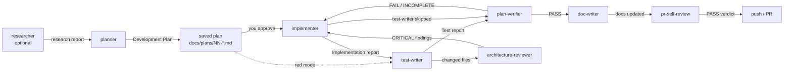

# Agents

Claude Code subagents for this repo. Each `<name>.md` holds the full contract: frontmatter plus
the agent's instructions. This file is only the map. To change what an agent does, edit its own
file. To add an agent, give it a row here.

## Catalog

| Agent | Responsibility | Model | Tools (allowed / denied) | Writes files |
|---|---|---|---|---|
| [researcher](researcher.md) | Answers one concrete question from the repo, external sources or both | sonnet | Read, Grep, Glob, Bash, WebSearch, WebFetch, Skill · denied Write, Edit, NotebookEdit | no |
| [planner](planner.md) | Turns one request into a Development Plan that honors modules, skills, INSIGHTS.md and architecture rules | opus | Read, Grep, Glob, Bash, Skill · preloads `onion-architecture`, `frontend-architecture`, `engineering-insights` · denied Write, Edit, NotebookEdit, Agent, WebSearch, WebFetch | no |
| [implementer](implementer.md) | Executes an approved plan in server/client, loads the matching skills, runs the checks, and checks its own diff against the plan | sonnet | Read, Grep, Glob, Bash, Edit, Write, Skill · preloads `engineering-insights` · denied Agent, NotebookEdit, WebSearch, WebFetch | yes |
| [test-writer](test-writer.md) | Writes behavioural tests for implemented server/client code (`mode: after`), or red-mode tests for an approved plan before implementation (`mode: red`); proves every test can fail and never fixes production code | sonnet | Read, Grep, Glob, Bash, Edit, Write, Skill · preloads `engineering-insights` · denied Agent, NotebookEdit, WebSearch, WebFetch | yes (tests only) |
| [architecture-reviewer](architecture-reviewer.md) | Read-only audit of a module, package or branch diff against the onion and frontend-architecture rules; mechanical checks (`pnpm arch`, lint, shared-contracts check) first, judgement second | opus | Read, Grep, Glob, Bash · preloads `onion-architecture`, `frontend-architecture` · denied Write, Edit, NotebookEdit, Agent, WebSearch, WebFetch | no |
| [plan-verifier](plan-verifier.md) | Read-only traceability check of finished code against every Development Plan item and spec requirement; one verdict per item, PASS/FAIL/INCOMPLETE overall | opus | Read, Grep, Glob, Bash · denied Write, Edit, NotebookEdit, Agent, WebSearch, WebFetch | no |
| [doc-writer](doc-writer.md) | Turns an implemented plan, spec or report into docs grounded in the current code: picks the Diátaxis kind and location, updates the folder index, draws Mermaid diagrams | sonnet | Read, Grep, Glob, Bash, Edit, Write, Skill · preloads `mermaid-diagram`, `engineering-insights` · denied Agent, NotebookEdit, WebSearch, WebFetch | yes (docs only) |
| [pr-skill-reviewer](pr-skill-reviewer.md) | Reviews changed lines against ONE skill, or for plain correctness | sonnet | Read, Grep, Glob, Bash · denied Write, Edit, NotebookEdit | no |
| [pr-finding-verifier](pr-finding-verifier.md) | Tries to refute ONE CRITICAL finding | opus | Read, Grep, Glob, Bash · denied Write, Edit, NotebookEdit | no |

Bash is read-only by instruction for every agent except `implementer`, `test-writer` and `doc-writer`:
`git log/show/diff`, `ls`, `cat`, `sed -n`, `rg`/`grep`. `architecture-reviewer` and `plan-verifier`
may also run named check commands, never with `--fix` or `sync`: `architecture-reviewer` runs only
`pnpm arch`, `pnpm lint` and `./scripts/shared-contracts.sh check`; `plan-verifier` runs the plan's
Verification checks and the `routing.json` package checks (including tests) plus the same contracts
check, all read from `routing.json`. None of them commits, pushes or opens PRs. For `git push`,
`gh pr create` and `gh pr merge`, the `pr-self-review` hook in `.claude/settings.json` blocks the
command whoever runs it.

## Inputs and outputs

| Agent | Input | Output |
|---|---|---|
| researcher | One question (repository, external, or both) | Repository report and/or External report: Answer · Findings with evidence · Code map / Sources · Conflicts · **Not found** — or a Clarification report |
| planner | One feature/fix request, optionally a `specs/NN-*.md` | Development Plan (`Status: draft`); the caller saves it as `docs/plans/NN-short-name.md` — or a Clarification report |
| implementer | Path to an approved plan in `docs/plans/` | Code, tests, updated plan/spec `Status`, `INSIGHTS.md` entries; Implementation report (steps · deviations · skills applied · checks · not run · handoff to review) — or a Plan deviation report |
| test-writer | Plan path + `mode: after`/`red`, or target files/module + behaviour | Tests next to their subject; Test report (tests written · proof · stability · checks · bugs found) — or a Blocked report — or a Clarification report |
| architecture-reviewer | `mode: diff` (+ `base`) or `mode: module` (+ `target`), optional plan path | One JSON object: `checks`, `findings` (with `in_change`), `rubric_read`, `not_checked` — or a clarification JSON |
| plan-verifier | Plan path (+ Implementation report, + `base`) | Plan verification report: `PASS`/`FAIL`/`INCOMPLETE` verdict, traceability matrix, coverage gaps — or a Clarification report |
| doc-writer | Plan/spec/implementation report/notes, optional audience | Docs in `docs/` or `<package>/docs/`, index updates, `INSIGHTS.md` entries; Documentation report — or a Clarification report |
| pr-skill-reviewer | `skill`, `repo_root`, `merge_base`, `files`, rubric and contract paths | One JSON object with findings ([reviewer-contract.md](../skills/pr-self-review/references/reviewer-contract.md)) |
| pr-finding-verifier | One CRITICAL finding, `merge_base`, rubric and contract paths | One JSON verdict: `confirmed` · `downgrade` · `refuted` |

`pr-skill-reviewer` and `pr-finding-verifier` are spawned only by the
[pr-self-review](../skills/pr-self-review/SKILL.md) skill. They are not for general use.
Architecture-reviewer CRITICALs with `in_change: true` may be re-checked by the main session;
`pr-finding-verifier` itself stays spawned by `pr-self-review` only.

## Feature flow

- **The plan is the only handoff.** `implementer` gets nothing from the planning conversation. That
  is why every step in the plan carries its files, rules with `path:line` and a "Done when" condition.
- **Both agents read the same routing file.** `planner` and `implementer` both use
  [routing.json](../skills/pr-self-review/assets/routing.json), which maps paths to skills and
  packages to checks. So the skills listed in a plan are exactly the skills the implementer loads,
  and the same skills `pr-self-review` later reviews against. The planner loads each of those
  skills in full and puts their practices into the steps, so best practices are decided by
  the stronger model (opus) rather than improvised by the implementer. The `security`
  skill is applied too, as implementation practice; the security *review* still belongs to a
  separate agent.
- **Subagents cannot ask the user questions.** The `AskUserQuestion` tool is filtered out for
  subagents. When a request is vague, `researcher`, `planner`, `implementer`, `test-writer`,
  `architecture-reviewer`, `plan-verifier` and `doc-writer` all return a Clarification or Plan
  deviation report instead of guessing, and the main session relays it.
- **Verification is independent.** `plan-verifier` (opus) re-checks every plan item against the
  code itself; the implementer's Implementation report is a pointer to evidence, not evidence.

## Sources

### planner and implementer

Official Claude Code and Anthropic sources (checked 2026-09-24 by `researcher`):

| Source | Rule it grounds |
|---|---|
| [Subagents](https://code.claude.com/docs/en/sub-agents) | `tools` allowlist vs `disallowedTools`. `skills:` preloads full skill text and does not limit the Skill tool. `AskUserQuestion` is filtered for subagents. Denying `Agent` stops nesting. Short, trigger-style `description` |
| [Permission modes](https://code.claude.com/docs/en/permission-modes) | In `auto`, `acceptEdits` and `bypassPermissions` sessions, a subagent's `permissionMode` is ignored, so planner's read-only rule is enforced by leaving `Write`/`Edit` out of its tools, not by `permissionMode: plan` |
| [Skill authoring best practices](https://platform.claude.com/docs/en/agents-and-tools/agent-skills/best-practices) | Loading skills on demand (progressive disclosure) instead of preloading all of them: planner preloads the two architecture skills plus `engineering-insights`, and loads the other routed skills through the Skill tool |
| [When to use multi-agent systems](https://claude.com/blog/building-multi-agent-systems-when-and-how-to-use-them) (2026-01-23) | Warns that splitting agents by role (planner → implementer) loses context at each handoff; hence the self-contained plan, the Plan deviation stop, and review as a separate verification step |
| [Effective context engineering](https://www.anthropic.com/engineering/effective-context-engineering-for-ai-agents) (2025-09-29) | Exploration runs in an isolated context and returns a condensed result; planner returns only the plan |

Project sources:

| Source | Rule it grounds |
|---|---|
| [AGENTS.md](../../AGENTS.md) | Naming, cross-package rules (shared contracts sync, migrations only via `db:generate`), "Do not touch", spec `Status` updates |
| Per-package `AGENTS.md` and `INSIGHTS.md` | Read before planning or coding a module |
| [onion-architecture](../skills/onion-architecture/SKILL.md) · [frontend-architecture](../skills/frontend-architecture/SKILL.md) | Where server and client code lives, and which way imports point |
| [routing.json](../skills/pr-self-review/assets/routing.json) | Path → skills; package → checks (`typecheck`, `lint`, tests, `pnpm arch`), `extraChecks` |
| [engineering-insights](../skills/engineering-insights/SKILL.md) | How implementer records non-obvious findings |
| [TESTING.md](../../TESTING.md) | Unit tests vs `.it.test.ts` tests that need Postgres |
| [pr-self-review gate](../skills/pr-self-review/SKILL.md) | No push, PR or merge without a PASS verdict; never set `PR_SELF_REVIEW_OVERRIDE` |

### test-writer

Checked 2026-09-24 by `researcher`:

| Source | Rule it grounds |
|---|---|
| [Claude Code best practices](https://code.claude.com/docs/en/best-practices) | Give a runnable check and show evidence; writer/reviewer split |
| [Red/green TDD for coding agents](https://simonwillison.net/guides/agentic-engineering-patterns/red-green-tdd/) (practitioner) | Red mode; break check proves a test of existing code can fail |
| [Testing Library guiding principles](https://testing-library.com/docs/guiding-principles) | Test like the user; no internals |
| [Vitest mocking guide](https://vitest.dev/guide/mocking) | Restore mocks, unstub globals and envs after each test |
| [Fastify testing guide](https://fastify.dev/docs/latest/Guides/Testing) | `app.inject()`, an app factory, closing the app in an after hook |
| [Flaky tests at Google](https://testing.googleblog.com/2016/05/flaky-tests-at-google-and-how-we.html) | No sleeps or shared state; re-run new tests for stability |
| [Stryker mutation testing](https://stryker-mutator.io/docs/stryker-js/introduction) | Mutation testing as a signal; not adopted here — the break check is the lightweight version |
| [routing.json](../skills/pr-self-review/assets/routing.json) | `server-app`'s glob ignores `**/*.test.ts`, so skills route by the file under test |
| [TESTING.md](../../TESTING.md) | Behaviour at the seams; `.it.test.ts` split; `renderWithIntl` + `userEvent` |
| [onion-architecture tools.md](../skills/onion-architecture/references/tools.md) | Test style by ring: pure / service fakes / `.it.test.ts` / route + `app.inject` |

### architecture-reviewer

Checked 2026-09-24 by `researcher`:

| Source | Rule it grounds |
|---|---|
| [Architectural fitness function](https://www.thoughtworks.com/radar/techniques/architectural-fitness-function) (2018) | Mechanical checks first, judgement second |
| [dependency-cruiser rules reference](https://github.com/sverweij/dependency-cruiser/blob/main/doc/rules-reference.md) | What `pnpm arch` actually checks |
| [Claude Code code review guide](https://code.claude.com/docs/en/code-review) | `file:line` evidence, a small severity set, verification as a separate step |
| [claude-code-security-review](https://github.com/anthropics/claude-code-security-review) | Two-stage find → filter pattern (mirrored by `pr-finding-verifier`, not this agent) |
| [reviewer-contract.md](../skills/pr-self-review/references/reviewer-contract.md) | Finding JSON shape, reused unchanged and wrapped in `mode`/`target`/`checks` |
| [severity.md](../skills/pr-self-review/references/severity.md) | CRITICAL is a closed list (`onion-layer-violation`, `cross-package-import`, `contract-drift`, `check-failed`) |

### plan-verifier

Checked 2026-09-24 by `researcher`:

| Source | Rule it grounds |
|---|---|
| [FHWA systems engineering guide §3.3.6](https://ops.fhwa.dot.gov/seits/sections/section3/3_3_6.html) | Verification vs validation; one method per requirement; traceability matrix (ISO/IEC/IEEE 29148) |
| [spec-kit agentic SDD reference](https://github.github.com/spec-kit/reference/agentic-sdd.html) | Read-only coverage report; uncovered requirements and unplanned changes |
| [Kiro specs correctness](https://kiro.dev/docs/specs/correctness/) | Requirement ↔ test traceability; tests are evidence, not proof |
| [Demystifying evals for AI agents](https://www.anthropic.com/engineering/demystifying-evals-for-ai-agents) (2026-01-09) | One dimension per judgment; allow "cannot verify" instead of guessing |
| [Developing tests](https://platform.claude.com/docs/en/test-and-evaluate/develop-tests) | Structured, constrained report output |

### doc-writer

Checked 2026-09-24 by `researcher`:

| Source | Rule it grounds |
|---|---|
| [Diátaxis](https://diataxis.fr/) | One doc kind per document: tutorial, how-to, reference, explanation |
| [Docs as code](https://www.writethedocs.org/guide/docs-as-code/) | Docs live beside code, in the same repo, reviewed like code |
| [ADR GitHub](https://adr.github.io/) | ADR sections: Status, Context, Decision, Alternatives rejected, Consequences |
| [C4 model](https://c4model.com/) | Diagram levels; no deeper than container/component here |
| [Google developer documentation style guide](https://developers.google.com/style) | Active voice, present tense, second person |
| [GitHub diagrams](https://docs.github.com/en/get-started/writing-on-github/working-with-advanced-formatting/creating-diagrams) | GitHub renders Mermaid natively; no diagram images |
| [Mermaid config schema](https://mermaid.js.org/config/schema-docs/config.html) | `maxTextSize` and other renderer limits |
| [server/docs/0001-latest-review-is-a-batch.md](../../server/docs/0001-latest-review-is-a-batch.md) | The ADR shape doc-writer follows |
| [mermaid-diagram](../skills/mermaid-diagram/SKILL.md) | Diagram type choice, ≤ ~20 nodes, labeled edges, one direction, no colours |

## Adding an agent

- Frontmatter: `name`, a `description` that says what the agent does and when to use it, a `tools`
  allowlist, `disallowedTools` for anything risky, and a `model`.
- Body: second person, imperative, English. Put the output format last, and include a
  clarification or stop path.
- Add a row to both tables above. When the agent's rules come from outside this repo, cite the source.
