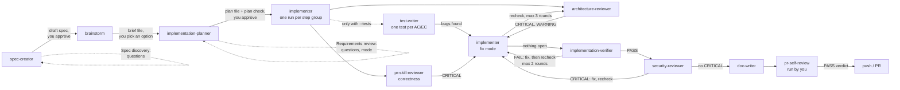

# Agents

Claude Code subagents for this repo. Each `<name>.md` holds the full contract: frontmatter plus
the agent's instructions. This file is only the map. To change what an agent does, edit its own
file. To add an agent, give it a row here.

## Catalog

| Agent | Responsibility | Model | Tools (allowed / denied) | Writes files |
|---|---|---|---|---|
| [spec-creator](spec-creator.md) | Writes one feature spec (problem, user stories, EARS acceptance criteria, edge cases, inputs with provenance, untrusted inputs) from the user's sources; analyzes the design for gaps, edge cases, module interactions and UX improvements and asks before writing | opus | Read, Grep, Glob, Skill, ToolSearch, Write, Edit, Figma read tools, and Agent for `researcher` only: no `tools` allowlist (it would hide the Figma tools), so a default-deny `PreToolUse` hook is the allowlist · preloads `spec-authoring`, `security` · denied Bash, NotebookEdit, WebSearch, WebFetch · a `PostToolUse` hook runs the spec check after each write | yes (`specs/*.md`, `<package>/specs/*.md`, `Status: draft` only) |
| [brainstorm](brainstorm.md) | Compares ways to build an approved spec or a fix: 3–5 options scored in a weighted matrix with a sensitivity check, or a short brief when only one way is viable; recommends one | sonnet | Read, Grep, Glob, Bash, WebSearch, WebFetch, Skill, Write, Edit · preloads `onion-architecture`, `frontend-architecture` · denied NotebookEdit, Agent · a `PreToolUse` hook limits Write/Edit to its brief | yes (`docs/plans/NN-*.brainstorm.md`, `Status: awaiting choice` only) |
| [researcher](researcher.md) | Answers one concrete question from the repo, external sources or both | sonnet | Read, Grep, Glob, Bash, WebSearch, WebFetch, AskUserQuestion (filtered out when run as a subagent), Skill · denied Write, Edit, NotebookEdit | no |
| [implementation-planner](implementation-planner.md) | Reviews the requirements (questions, recommendations, execution mode), then turns them into a Development Plan that honors modules, skills, INSIGHTS.md and architecture rules, and cites every spec id. Writes no specs | opus | Read, Grep, Glob, Bash, Skill, AskUserQuestion (filtered out when run as a subagent), Write, Edit · preloads `onion-architecture`, `frontend-architecture`, `engineering-insights` · denied NotebookEdit, Agent, WebSearch, WebFetch · a `PreToolUse` hook limits Write/Edit to its plan; a `PostToolUse` hook runs the plan check | yes (`docs/plans/NN-*.md`, `Status: draft` only) |
| [implementer](implementer.md) | Executes an approved plan in server/client by the practices written into each step, repairs the tests it breaks (writes new ones only in single-agent mode), runs the checks, and checks its own diff against the plan | sonnet | Read, Grep, Glob, Bash, Edit, Write, Skill · preloads `engineering-insights` · denied Agent, NotebookEdit, WebSearch, WebFetch | yes |
| [test-writer](test-writer.md) | **Off in the default flow for now** (runs with `/sdd --tests` or when asked by name). Writes the feature's tests, one per spec criterion (`AC-n`, `EC-n`) with the id in the test name, for implemented server/client code (`mode: after`), or red-mode tests for an approved plan before implementation (`mode: red`); proves every test can fail and never fixes production code | sonnet | Read, Grep, Glob, Bash, Edit, Write, Skill · preloads `engineering-insights` · denied Agent, NotebookEdit, WebSearch, WebFetch | yes (tests only) |
| [architecture-reviewer](architecture-reviewer.md) | Read-only audit of a module, package or branch diff against the onion and frontend-architecture rules; mechanical checks (`pnpm arch`, lint, shared-contracts check) first, judgement second; `recheck:` after a fix | sonnet | Read, Grep, Glob, Bash · preloads `onion-architecture`, `frontend-architecture` · denied Write, Edit, NotebookEdit, Agent, WebSearch, WebFetch | no |
| [implementation-verifier](implementation-verifier.md) | The last gate: read-only traceability check of finished code against every spec requirement and plan step (mechanical items come from `check-plan.mjs --implemented`); one verdict per item, PASS/FAIL/INCOMPLETE overall; `recheck:` after a fix | sonnet | Read, Grep, Glob, Bash · denied Write, Edit, NotebookEdit, Agent, WebSearch, WebFetch | no |
| [security-reviewer](security-reviewer.md) | Read-only security audit of a branch diff: traces attacker-controlled input to sensitive sinks and reports only confirmed exploitable paths | sonnet | Read, Grep, Glob, Bash · preloads `security` · denied Write, Edit, NotebookEdit, Agent, WebSearch, WebFetch | no |
| [doc-writer](doc-writer.md) | Turns an implemented plan, spec or report into docs grounded in the current code: picks the Diátaxis kind and location, updates the folder index, draws Mermaid diagrams | sonnet | Read, Grep, Glob, Bash, Edit, Write, Skill · preloads `mermaid-diagram`, `engineering-insights` · denied Agent, NotebookEdit, WebSearch, WebFetch | yes (docs only) |
| [pr-skill-reviewer](pr-skill-reviewer.md) | Reviews changed lines against ONE skill, or for plain correctness (the feature flow uses the correctness mode right after the build) | sonnet | Read, Grep, Glob, Bash · denied Write, Edit, NotebookEdit | no |
| [pr-finding-verifier](pr-finding-verifier.md) | Tries to refute ONE CRITICAL finding | opus | Read, Grep, Glob, Bash · denied Write, Edit, NotebookEdit | no |

Bash is read-only by instruction for every agent except `implementer`, `test-writer` and
`doc-writer`: `git log/show/diff`, `ls`, `cat`, `sed -n`, `rg`/`grep`. `brainstorm` uses the same
read-only list as `researcher`. `architecture-reviewer` and `implementation-verifier` may also
run named check commands, never with `--fix` or `sync`: `architecture-reviewer` runs only
`pnpm arch`, `pnpm lint` and `./scripts/shared-contracts.sh check`; `implementation-verifier`
runs `./scripts/check-changed.sh` (the `routing.json` package checks, tests included, plus the
contracts check), the plan check and the plan's own Verification commands. `implementation-planner`
and `brainstorm` have Write and Edit for one file each, enforced by
[plans-guard.mjs](../hooks/plans-guard.mjs). `security-reviewer` may also run
`pnpm audit --prod` or `npm audit --omit=dev`, only when a `package.json` or lock file changed in
the diff, and never with `--fix`. None of them commits, pushes or opens PRs. For `git push`,
`gh pr create` and `gh pr merge`, the `pr-self-review` hook in `.claude/settings.json` blocks the
command whoever runs it.

`spec-creator` has no Bash at all. Its scope is enforced, not only instructed. It declares
`disallowedTools` rather than a `tools` allowlist, which leaves every other tool of the session
open, so the hook [spec-creator-guard.mjs](../hooks/spec-creator-guard.mjs), declared in the
agent's frontmatter with the matcher `*`, denies by default. It allows Read, Grep, Glob, Skill,
ToolSearch and TodoWrite; the Agent tool only with `subagent_type: researcher`; Write/Edit only in `specs/*.md` and `<package>/specs/*.md`, only on a
spec that is `Status: draft` and still is after the change (the hook applies the edit in memory
and checks the result); and MCP calls only to Figma read tools (`get_*`). One exception is the amendment: an `approved`
spec may be edited when the edit itself turns it back into a draft. A second hook,
`PostToolUse` on Write/Edit, runs
[check-spec.mjs](../skills/spec-authoring/assets/check-spec.mjs) `--hook` and returns the spec's
form errors to the agent. The guards and the checks have tests that run in the `pr-self-review` workflow.

## Inputs and outputs

| Agent | Input | Output |
|---|---|---|
| spec-creator | Pass 1: one feature request plus its sources (text brief, Figma links, design files, code paths, related specs). Pass 2: the user's answers, sent to the same agent | Pass 1: Spec discovery report (research results · design gaps · uncovered edge cases · module interactions · preliminary inputs and provenance · proposals · questions with numbered options), nothing written. Pass 2: the spec file `NN-short-name.md` (`Spec ID: SPEC-NN`, `Status: draft`) plus its index line; Spec report |
| brainstorm | An approved spec path, or one problem for a fix with no spec | The brief file `docs/plans/NN-short-name.brainstorm.md` (`Status: awaiting choice`: options, weighted matrix, sensitivity, recommendation, planner inputs — or the short form when one way is viable) and a Brief summary — or a Clarification report |
| researcher | One question (repository, external, or both) | Repository report and/or External report: Answer · Findings with evidence · Code map / Sources · Conflicts · **Not found** — or a Clarification report |
| implementation-planner | One feature/fix request, optionally a `specs/NN-*.md`, optionally a chosen brainstorm brief, optionally `mode: multi-agent` / `single-agent` and the answers to its Requirements review | First a Requirements review (requirements · questions · recommendations · execution mode) unless nothing is open; then the plan file `docs/plans/NN-short-name.md` (`Status: draft`, `Execution mode:`, step groups, an implementer brief above `<!-- implementer-brief:end -->`, a `Covers` line of spec ids per step) and a Plan summary |
| implementer | Plan mode: plan path + step group (+ previous group's handoff). Fix mode: a gap list with `path:line` (verifier `To reach PASS`, reviewer CRITICALs) | Code, repaired tests, updated plan/spec `Status`, `INSIGHTS.md` entries; Implementation report (steps · deviations · skills loaded · tests touched · checks · not run · handoff to the next group · handoff to review) — or a Plan deviation report (also when the plan is still a draft) |
| test-writer | Plan path + `mode: after`/`red`, or target files/module + behaviour | Tests next to their subject, named by spec id; Test report (tests written · coverage per spec id · not covered · proof · stability · checks · bugs found) — or a Blocked report — or a Clarification report |
| architecture-reviewer | `mode: diff` (+ `base`) or `mode: module` (+ `target`), optional plan path; `recheck:` with its earlier findings and `fixed_files:` after a fix | One JSON object: `checks`, `findings` (with `id`, `in_change`), `rechecked` (`closed` / `open` per id), `rubric_read`, `not_checked` — or a clarification JSON |
| implementation-verifier | Plan path (+ Implementation report, + Test report, + `base`, + `recheck: <ids>` after a fix) | Implementation verification report: `PASS`/`FAIL`/`INCOMPLETE` verdict, traceability matrix, coverage gaps — or a Clarification report |
| security-reviewer | `mode: diff` (+ `base`), optional plan path | One JSON object: `checks`, `findings` (with `in_change`/`owasp`/`source`/`sink`), `needs_manual_check`, `not_checked` — or a clarification JSON |
| doc-writer | Plan/spec/implementation report/notes, optional audience | Docs in `docs/` or `<package>/docs/`, index updates, `INSIGHTS.md` entries; Documentation report — or a Clarification report |
| pr-skill-reviewer | `skill` (a SKILL.md path or `correctness`), `repo_root`, `merge_base`, `files`, rubric and contract paths | One JSON object with findings ([reviewer-contract.md](../skills/pr-self-review/references/reviewer-contract.md)) |
| pr-finding-verifier | One CRITICAL finding, `merge_base`, rubric and contract paths | One JSON verdict: `confirmed` · `downgrade` · `refuted` |

`pr-skill-reviewer` and `pr-finding-verifier` are spawned by the
[pr-self-review](../skills/pr-self-review/SKILL.md) skill. The feature flow also starts one
`pr-skill-reviewer` in `correctness` mode right after the build. They are not for general use.
Architecture-reviewer CRITICALs with `in_change: true` may be re-checked by the main session;
`pr-finding-verifier` itself stays spawned by `pr-self-review` only.

## Feature flow

```mermaid
flowchart LR
  SC[spec-creator] -.->|Spec discovery:<br/>questions| SC
  SC -->|draft spec,<br/>you approve| B[brainstorm]
  B -->|brief file,<br/>you pick an option| P[implementation-planner]
  P -.->|Requirements review:<br/>questions, mode| P
  P -->|plan file + plan check,<br/>you approve| I[implementer<br/>one run per step group]
  I -.->|only with --tests| TW[test-writer<br/>one test per AC/EC]
  I --> AR[architecture-reviewer]
  I --> CR[pr-skill-reviewer<br/>correctness]
  TW -->|bugs found| F[implementer<br/>fix mode]
  AR -->|CRITICAL, WARNING| F
  CR -->|CRITICAL| F
  F -->|recheck, max 3 rounds| AR
  F -->|nothing open| PV[implementation-verifier]
  PV -->|FAIL: fix, then recheck<br/>max 2 rounds| F
  PV -->|PASS| SEC[security-reviewer]
  SEC -->|CRITICAL: fix, recheck| F
  SEC -->|no CRITICAL| DW[doc-writer]
  DW --> SR[pr-self-review<br/>run by you]
  SR -->|PASS verdict| PUSH[push / PR]
```

You start it with the `/sdd` command ([sdd](../skills/sdd/SKILL.md)): pass a spec, a plan,
designs and a requirements prompt in any mix, and it picks the stage to start from. How the main
session then runs the flow — what each agent is handed, what goes out in one message, the
pre-flight, the fix rounds — is the [feature-flow](../skills/feature-flow/SKILL.md) skill. The
rules below are why the flow has this shape.

- **Two approvals are yours.** A spec and a plan both start as `Status: draft` and only you
  approve them (the main session writes `approved` on your word). `brainstorm` and
  `implementation-planner` stop on a draft spec, `implementer` stops on a draft plan, and
  [check-plan.mjs](../skills/feature-flow/assets/check-plan.mjs) fails a plan whose spec is not
  approved or that leaves an `AC-n`, `EC-n` or `NFR-n` without a step.
- **New tests are off for now.** To save tokens, nobody writes new tests in the default flow:
  `implementer` only repairs the tests its change breaks, `test-writer` is not started, and the
  verifier checks each criterion by reading the code (it says so in its report). The plan still
  records what should be tested on each step's `Tests (test-writer)` line. `/sdd --tests` turns
  the stage on for one feature: `test-writer` then writes at least one test per `AC-n` and `EC-n`
  from the spec's wording, with the id first in the test name, so the verifier finds a criterion's
  evidence by searching for its id. You can also ask for `test-writer` by name later, on finished
  code. Test writing was the largest share of the implementer's calls, which is why it does not
  go back there.
- **One agent on request.** Ask for `spec-creator` or `implementation-planner` by name, or run
  `/sdd --only spec` / `--only plan`, and only that agent runs: its questions are relayed, its
  file is written, and the flow stops there. A standalone planner needs no brainstorm brief.
- **Bugs are looked for right after the build.** `architecture-reviewer` judges structure only.
  Logic errors are the correctness reviewer's job (`pr-skill-reviewer` with `skill: correctness`),
  which runs in the same message as `architecture-reviewer` (and `test-writer`, when tests are
  on). Their findings go to one fix-mode `implementer`.
- **Architecture comments get their own loop.** The fix covers the architecture CRITICALs and
  WARNINGs on changed lines; then `architecture-reviewer` runs again with `recheck:`, reading
  only the files the fix touched, and says per finding id whether it is closed. What is still
  open, or new, is the next round. Three rounds at most; after that the main session stops and
  asks you. SUGGESTIONs are listed in the closing report, not fixed.
- **A gap in an approved spec is amended, not worked around.** The planner recommends it; you
  decide; `spec-creator` reopens the spec as a draft, adds the criterion under the next free id
  and an `Amended:` line; you approve again. Ids are never renumbered.
- **The plan is the only handoff.** `implementer` gets nothing from the planning conversation. That
  is why every step in the plan carries its files, rules with `path:line` and a "Done when" condition.
- **The spec says what, the plan says how.** `spec-creator` writes the spec first: problem, user
  stories, EARS acceptance criteria (`AC-n`), edge cases (`EC-n`), inputs with provenance and
  untrusted inputs. It may hold workflow diagrams and contracts between modules, but no
  implementation details. The rules of the spec itself (template, EARS, ids, provenance tags) are
  the [spec-authoring](../skills/spec-authoring/SKILL.md) skill, not the agent file; the planner
  and the verifier keep the spec's `AC-n` / `EC-n` / `NFR-n` ids, so a criterion can be followed
  from the spec through the plan to the verification matrix. It runs in two passes: the Spec discovery report comes back first, the
  main session relays its questions and proposals with `AskUserQuestion` and sends the answers to
  the same agent with `SendMessage`, and only then is the draft written. It works from the sources
  you give plus the repo, and reads only the `INSIGHTS.md` files of the modules and packages the
  feature touches. For a question that reading does not settle (a sweep of the repo, or a fact
  about an outside API or library) it starts up to 4 `researcher` agents in parallel, one
  question each; an outside finding supports a question or a proposal, never a requirement by itself. It always writes `Status: draft`; you set `approved`. `brainstorm` then
  explores how to build the approved spec, and `implementation-planner` plans the chosen option.
- **Requirements in, plan out.** `implementation-planner` writes implementation plans only. It never
  writes or edits a spec; a spec changes only through `spec-creator` or by your own hand. Before planning it reviews the
  requirements it was given, asks about gaps and contradictions, and recommends how to reach the
  goal better. A recommendation enters the plan only after you accept it.
- **You choose the execution mode.** The planner asks every time the request does not state it.
  `multi-agent` is the flow in the diagram: step groups, one `implementer` per group, then the
  review agents. `single-agent` is one agent doing every step in one pass (one group `G1`),
  with no handoffs and no review agents; the package checks and the `pr-self-review` gate still apply.
  The main session relays the Requirements review with `AskUserQuestion` and sends the answers to
  the same planner with `SendMessage`, so it does not re-read the repo.
- **Both agents read the same routing file.** `implementation-planner` and `implementer` both use
  [routing.json](../skills/pr-self-review/assets/routing.json), which maps paths to skills and
  packages to checks. So the skills listed in a plan are exactly the skills the implementer loads,
  and the same skills `pr-self-review` later reviews against. The planner loads each of those
  skills in full and puts their practices into the steps, so best practices are decided by
  the stronger model (opus) rather than improvised by the implementer. The implementer does not
  load the skills again: it follows the steps' `Practices` lines and loads a skill only where a
  step says `load:`. The `security`
  skill is applied too, as implementation practice; `security-reviewer` does the security
  *review*, after `implementation-verifier` PASS.
- **Subagents cannot ask the user questions.** The `AskUserQuestion` tool is filtered out for
  subagents. When a request is vague, `spec-creator`, `brainstorm`, `researcher`, `implementation-planner`, `implementer`,
  `test-writer`, `architecture-reviewer`, `implementation-verifier`, `security-reviewer` and
  `doc-writer` all return a Clarification, Spec discovery, Requirements review or Plan deviation report instead of guessing, and the
  main session relays it.
- **Verification is independent, and last.** `implementation-verifier` re-checks every spec
  requirement and plan step against the code itself; the implementer's Implementation report is a
  pointer to evidence, not evidence. It runs after the review loop, because a PASS on code that then changes is void (and, when
  tests are on, its evidence includes the tests); after a later fix it
  runs again with `recheck:`. It does not grade the steps' `Practices` or the plan's constraints:
  `architecture-reviewer` and `pr-self-review` do. The static part of its old job, a spec id no
  step covers, moved to the plan check, before any code exists. It runs on sonnet: its work is item-by-item traceability with `path:line` evidence.
- **Opus only where the artifact steers everything after it.** `spec-creator` and
  `implementation-planner` run on opus; so does `pr-finding-verifier`, which decides a block.
  Everything else runs on sonnet: `brainstorm`, `architecture-reviewer` and `security-reviewer`
  moved there on 2026-10-04 to save tokens. `brainstorm` stays a required stage of the full flow;
  its brief is checked twice after it, by you when you pick an option and by the opus planner,
  which verifies every `path:line` it reuses. Their findings carry a quoted
  line and a rule, their CRITICAL list is closed and starts from mechanical checks, and
  `/pr-self-review` reviews the same skills again with an opus verifier for every CRITICAL.

## Keeping token cost down

Every tool call re-reads the agent's whole context, so cost grows with context length × number of
calls, far more than with the model. On the Intent Layer feature, one implementer running 290
calls up to a 535K-token context cost more than all planning and review together. The measurements
behind these rules are in [docs/agent-workflow-cost.md](../../docs/agent-workflow-cost.md).

- **brainstorm runs as one agent, on sonnet.** It was pinned to `claude-opus-5-5` until
  2026-10-04, when the user moved it to sonnet to save tokens. Subagents can nest (up to 3 layers,
  `CLAUDE_CODE_MAX_SUBAGENT_SPAWN_DEPTH`), but N parallel option-agents would cost about N× tokens. That is an estimate: cost is context ×
  calls per agent ([agent-workflow-cost.md](../../docs/agent-workflow-cost.md)), and each
  option-agent would re-read the same context. So one agent writes all options
  and denies `Agent`. The main session sets the brief's `Status: chosen: option <k>` after the
  user picks, then passes the brief path to `implementation-planner`.
- **One implementer run per step group.** Run the plan's step groups in order, each in a fresh
  `implementer`, and pass along the previous run's "Handoff to the next group". Do not resume a
  finished implementer for the next group.
- **Pass paths, not content.** Prompts to agents carry the plan path, the group and the handoff,
  never the plan text or a diff. Agents read diffs themselves, narrowly. `implementation-planner`
  and `brainstorm` write their own files and return a ten-line summary, so a plan is never an
  agent's output twice and never sits in the main session's context.
- **A small start for the implementer.** It reads its step group, the package `AGENTS.md` and only
  the matching entries of an `INSIGHTS.md` (the package files are 40–50 KB); no `routing.json`, no
  skills unless a step says `load:`. Whatever it reads at the start is re-read on every later call.
- **Nobody writes new tests by default** (see above).
- **Fixes go in fix mode, in bounded rounds.** Hand the merged findings of the review stage, the
  verifier's `To reach PASS` list or the security CRITICALs to one `implementer` in fix mode. Three
  rounds in the review loop, two per later gate, then the main session stops and asks you. It coordinates and does not edit code
  itself.
- **Checks in one line each, and no more of them than needed.** Agents run
  `./scripts/check-changed.sh`, never a raw `pnpm typecheck` or a whole suite: one line per check,
  output only for a failure, and a package stops at its first failing check. A group that is not
  the last runs `--quick` (typecheck plus the tests related to the changed files); one failing
  check is re-run with `--check <id> --only <package>`.
- **Fresh main session after a break.** The main session's cache expires after an hour. Resuming a
  250K+ context after a break rewrites all of it at twice the input price. After a break of more
  than an hour, or when switching to manual testing or Q&A, start a new session from a short
  handoff note: the plan path, what is done, what is open. Give the planner the full request up
  front: a correction halfway through makes it write the plan twice.

## Sources

The outside and project sources each agent's rules come from, with the date they were checked,
are in [docs/agent-sources.md](../../docs/agent-sources.md).

## Adding an agent

- Frontmatter: `name`, a `description` that says what the agent does and when to use it, a `tools`
  allowlist, `disallowedTools` for anything risky, and a `model`.
- Body: second person, imperative, English. Put the output format last, and include a
  clarification or stop path.
- Add a row to both tables above. When the agent's rules come from outside this repo, cite the source.
