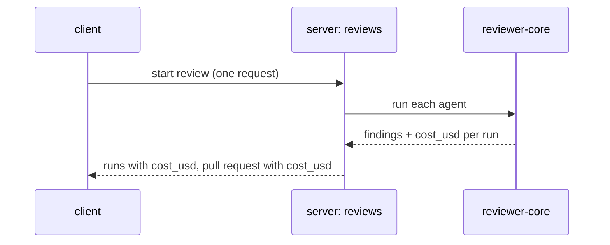

# Spec: Run Cost Badge
Spec ID: SPEC-00
Status: draft
Supersedes: none
Packages: server, client
Sources: specs/01-run-cost-badge.md (the legacy spec, retold in the current template as a worked example; SPEC-00 is not a live spec)

## Problem and user
A developer who runs agent reviews on pull requests cannot see what a review cost. The
provider returns the cost of every model call, but the product drops it, so the developer
learns the price only from the provider's billing page, long after the run.

## Goals / Non-goals
**Goals**
- The developer sees the cost of a review run next to its result, without leaving the studio.
- The cost shown for a pull request describes the same runs as its score and findings count.

**Non-goals**
- Cost for runs stored before this feature — they have no data to show; backfilling would need
  the provider's history.
- Cost spent by a run that failed mid-flight — the review engine does not report partial usage
  (OQ-1).
- Cost of CI runs in the pull-request list — they are not part of a review round.

## User stories
- US-1: As a developer, I want to see what each agent run cost, so that I can compare agents by
  price as well as by findings.
- US-2: As a developer, I want to see what the latest review of a pull request cost, so that I
  can spot expensive pull requests in the list.

## Workflow and module interactions

Contract fields that cross the server → client boundary:
- run summary `cost_usd: number | null` — `null` means "no data";
- pull-request list item `cost_usd: number | null` — sum over the latest review round.

## Acceptance criteria (EARS)
- AC-1 (US-1): WHEN an agent run completes, the server shall store the run's cost in US dollars
  as reported by the review engine.
- AC-2 (US-1): WHILE a run is in the state done, the run timeline card shall show one line with
  the run's token count followed by its cost, in the form `9,119 tok · $0.0013`.
- AC-3 (US-1): IF a run has no stored cost, THEN the client shall show `—` in place of the cost.
- AC-4 (US-2): The pull-request list shall show, for each pull request, the sum of the stored
  costs of the runs in its latest review round.
- AC-5 (US-2): IF no run in the latest review round has a stored cost, THEN the pull-request list
  shall show `—` for that pull request.
- AC-6 (US-1, US-2): WHILE a cost is below $0.01, the client shall show it with 4 decimals.
- AC-7 (US-1, US-2): WHILE a cost is at least $0.01 but below $1, the client shall show it with 3
  decimals.
- AC-8 (US-1, US-2): WHILE a cost is $1 or more, the client shall show it with 2 decimals.

## Edge cases
- EC-1: a run finished before this feature shipped → `—`, never `$0.00` (AC-3)
- EC-2: a run failed or is still running → no cost on its card (AC-2, AC-3)
- EC-3: a second review of the same pull request → the list shows only the new round (AC-4)
- EC-4: every run of the latest round failed → `—` in the list (AC-5)
- EC-5: a cost of exactly $0.01 or exactly $1 → the higher band's precision applies (AC-7, AC-8)

## Non-functional requirements
- NFR-1: The feature adds 0 model calls and 0 tokens to a review run.
- NFR-2: Both colour themes show the cost with the same contrast as the token count beside it.

## Inputs and provenance
| Input | Provenance | Notes |
|---|---|---|
| Cost of a run in US dollars | [reused: review engine run outcome] | Already returned per run; it was dropped before storage |
| Token count of a run | [reused: stored run statistics] | Shown today |
| Latest review round of a pull request | [deterministic: reviews] | Runs started by one review request |

## Untrusted inputs
None.

## Open questions
- OQ-1: Should a failed run report the cost spent before the failure? — default if unanswered:
  no; a failed run shows no cost.
