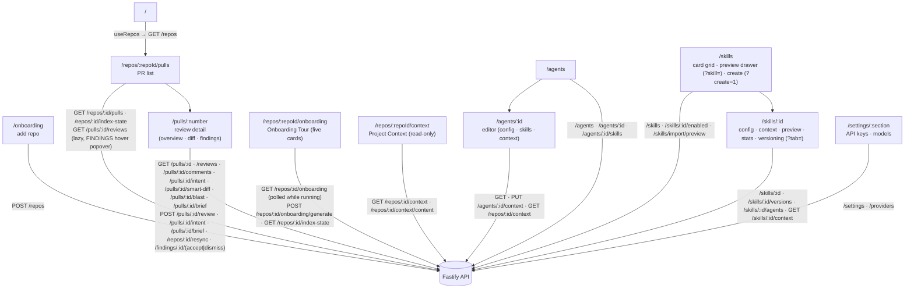

# `@devdigest/web` — the studio (Next.js 15)

The DevDigest UI: import repos, browse pull requests, run and read AI reviews,
and author agents. App Router (pages are client components; the root layout and metadata are server-rendered), data via
**TanStack Query** hooks over the Fastify API. (Skills landed in L02; later
lessons add the Memory, Eval, Blast/Brief, multi-agent, CI, and dashboard screens.)

- **Stack:** Next.js 15 (App Router), React 19, TanStack Query, `next-intl`
  (messages in `messages/<locale>/*.json`), `recharts`, `mermaid`,
  `react-markdown`. UI primitives are vendored under `src/vendor/ui`
  (`@devdigest/ui`) and shared Zod contracts under `src/vendor/shared`
  (`@devdigest/shared`).
- **API base:** `NEXT_PUBLIC_API_BASE` (default `http://localhost:3001`), used by
  `src/lib/api.ts`. Every data hook lives in `src/lib/hooks/*`.
- **Run:** `pnpm dev` (`:3000`). **Test:** `pnpm test` (vitest + jsdom, fetch
  mocked — no API needed). **Typecheck:** `pnpm typecheck`.

## UI route map

Routes (`src/app/**/page.tsx`) and the API surface each leans on (via
`src/lib/hooks/*` → `src/lib/api.ts`):

The PR detail's Overview tab renders the `IntentCard` first (before the PR
description): the PR's derived `{ summary, in_scope, out_of_scope }`, risk-area
chips, a confidence badge and a Derive / Re-derive intent action
(`src/lib/hooks/intent.ts`, `_components/OverviewTab/_components/IntentCard`).
Beside it sits the `BlastRadiusCard` (`src/lib/hooks/blast.ts`, `_components/OverviewTab/_components/BlastRadiusCard`):
the precomputed repo-intel map of what the PR's changed symbols reach (callers, endpoints, cron jobs) as a
tree or a plain-SVG graph, with a degraded-index notice and a Resync action.
Above them sits the `PrBriefBlock` (`src/lib/hooks/brief.ts`, `_components/OverviewTab/_components/PrBriefBlock`):
a Generate brief empty state, then the stored brief's summary, the latest review round's verdict and score,
a missing-data notice and a provenance footer. Below the two cards, `RiskAreas` and `ReviewFocus` list the
brief's risks and read-first lines; a click opens the Files changed tab at `?tab=diff&file=…&line=…`
(`pulls/[number]/use-diff-jump.ts`). See [`../docs/pr-brief.md`](../docs/pr-brief.md).
A `FindingCard` with `kind: 'out_of_scope'` shows an "Outside PR scope" badge.

The Onboarding Tour page (`/repos/:repoId/onboarding`, `src/app/repos/[repoId]/onboarding/_components/TourView`)
shows the stored tour as five cards, or an empty state with a Generate action. It polls the
read route every 1.5 s while a generation runs, marks the tour stale when the repo's indexed
commit differs from the tour's, and copies the whole tour as Markdown. It strips image
syntax from the overview body before rendering or copying. See
[`../docs/onboarding-tour.md`](../docs/onboarding-tour.md).

Cross-cutting chrome lives in `src/components/app-shell` (nav, breadcrumbs,
`g`-then-key shortcuts). Pages are thin; feature logic sits in colocated
`_components/<Name>/` folders, each with its own `*.test.tsx`.

## Testing

Component/interaction tests (`*.test.tsx`) run under vitest + jsdom with `fetch`
mocked, so they need neither the API nor a browser. The real browser journeys
(client + API + seeded DB) are covered by the deterministic agent-browser suite
in [`../e2e`](../e2e/README.md) and the `e2e-web.yml` workflow. See
[`../TESTING.md`](../TESTING.md).
