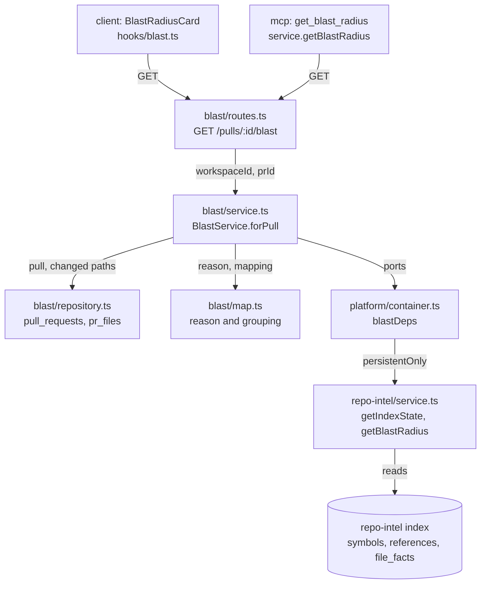

# Blast radius: what a PR reaches, and how the map is built

The blast radius answers one question about a pull request: which callers,
HTTP endpoints and cron jobs sit downstream of the symbols this PR changes.
DevDigest shows the answer in the **Blast radius** card on the PR Overview tab
and returns it to agents through the MCP tool `get_blast_radius`. Both read
the same route, `GET /pulls/:id/blast`.

The map is precomputed. The route reads the repo-intel index in Postgres. It
never calls an LLM and never parses the clone.

This page explains how the map is built and how to read it. It also lists the
response fields, the degraded reasons and the known limits. For the MCP tool's
arguments and token budget, see [devdigest-mcp.md](devdigest-mcp.md#blast-radius).

## What the map answers

- **Changed symbols.** The symbols declared in the files the PR changes.
- **Downstream callers.** For each changed symbol, the code that references it
  from another file. The map lists only references that resolve to the changed
  file. A reference that could belong to several files is not counted, because
  the index favors precision over recall.
- **Endpoints and cron jobs.** For each changed symbol, the HTTP routes and cron
  jobs declared in the files of its callers.

## Data flow

1. The route checks the params, resolves the workspace, and calls
   `BlastService.forPull` once.
2. The service loads the PR from the workspace (a PR from another workspace is a
   404) and its changed paths from `pr_files`.
3. It reads the index state and derives the degraded reason with `blastReason`.
4. It calls the repo-intel facade only when the index can answer (see
   [Skipped facade calls](#skipped-facade-calls)).
5. `toBlastRadius` groups the facade's flat caller list into the `BlastRadius`
   shape and counts it.
6. The service wraps the result in the `BlastRadiusResponse` envelope.

The module `server/src/modules/blast/` never imports `repo-intel`. Its
`ports.ts` declares narrow types, and `blastDeps` in
`server/src/platform/container.ts` adapts the facade to them.

## Response envelope

`BlastRadiusResponse` is defined in `server/src/vendor/shared/contracts/brief.ts`
and copied to the client. Wire fields are `snake_case`.

| Field | Type | Meaning |
|---|---|---|
| `blast.changed_symbols` | `{ name, file, kind }[]` | Symbols declared in the changed files, deduplicated by name and file. |
| `blast.downstream` | `{ symbol, callers, endpoints_affected, crons_affected }[]` | One entry per changed symbol that has callers. Symbols without callers are absent. |
| `blast.summary` | string | One English sentence. Three forms: "N changed symbol(s) reach C caller(s), E endpoint(s) and K cron job(s).", "N changed symbol(s), no downstream callers found.", or "No indexed symbols in the changed files." |
| `head_sha` | string | The PR's head commit. |
| `index.status` | `full` \| `partial` \| `degraded` \| `failed` | Status of the repo index. |
| `index.degraded` | boolean | `true` whenever `index.reason` is not `null`. |
| `index.reason` | reason \| `null` | Why the map is missing or incomplete. See [Degraded reasons](#degraded-reasons). |
| `index.indexed_sha` | string \| `null` | The commit the index was built from. `null` when nothing is indexed. |
| `limits.max_callers_per_symbol` | integer | The per-symbol caller cap (20). |
| `counts.changed_files` | integer | Rows in `pr_files` for the PR. |
| `counts.symbols` | integer | Length of `changed_symbols`. |
| `counts.callers` | integer | Unique `(file, name)` callers across all symbols. |
| `counts.endpoints`, `counts.crons` | integer | Unique endpoints and cron jobs across all symbols. |
| `truncated` | boolean | `true` when at least one symbol lost callers to the cap. |

Ordering is stable. `downstream` sorts by the best caller rank, then by caller
count, then by symbol name. Callers within a symbol sort by rank, then file,
then line. Endpoints and crons are sorted unique lists.

Counts describe the capped map. They are computed by the server, and the client
shows them as sent instead of recomputing them.

## Degraded reasons

`index.reason` comes from `blastReason` in `server/src/modules/blast/map.ts`. The
check order matters: the flag wins over everything else.

| Reason | How the server derives it | Map content |
|---|---|---|
| `flag_off` | `REPO_INTEL_ENABLED=false` on the server. | Empty. Facade not called. |
| `no_data` | No `repo_index_state` row (the facade synthesizes a `degraded` state), a `degraded` row stamped `no_data` (for example, the clone is not ready) or stamped with a string that is not a known reason, or the facade answers `degraded` after the state read. | Empty. |
| `index_failed` | Status `failed`, or a `degraded` row stamped `index_failed`. A `degraded` row with no stamped reason also reads as `index_failed`. | Empty. |
| `index_partial` | Status `partial`: the indexer hit its time budget, the graph build failed, or a file failed to parse. | The facade is still called. The map is shown, and callers may be missing. |
| `repo_too_large` | A `degraded` row stamped `repo_too_large`. No indexer path writes it today. | Empty. |
| `null` | Status `full` with the flag on. | Full map. |

An index with `index.status` of `full` gives `degraded: false`. In every other
case the card shows a warning notice with the reason text and, except for
`flag_off`, a **Resync index** button.

### Skipped facade calls

`shouldQueryFacade` allows a facade call only when the PR has changed files and
the reason is `null` or `index_partial`. In every other case the service returns
an empty map without calling the facade.

The service also passes `persistentOnly: true` through `blastDeps`. With that
option, `RepoIntelService.getBlastRadius` never takes its clone-parsing
fallback. If the index row changes between the state read and the map read, the
facade returns an empty degraded `no_data` result, and the service maps it to
`reason: 'no_data'`. Other callers of `getBlastRadius`, such as reviews, keep the
fallback.

## Limits

| Limit | Value | Where it applies |
|---|---|---|
| Callers per changed symbol | 20 (`BLAST_LIMITS.maxCallersPerSymbol`) | The facade cuts each changed symbol's callers at 20 and reports it. The mapper applies the same cap and ORs its own detection into `truncated`. The cap is per symbol, so a symbol with many callers cannot take the callers of another. |
| MCP result size | 24,000 characters | The tool drops the lowest-ranked `downstream` entries, then the tail of `changed_symbols`, and sets `truncated`. See [devdigest-mcp.md](devdigest-mcp.md#blast-radius). |
| Resync wait | 120 seconds | The card stops waiting for a resync to land and shows a timeout message. |

The cap lives in one place, `@devdigest/shared`. The repo-intel constant
`MAX_CALLERS_PER_SYMBOL` re-exports it.

## How each surface reads the map

- **Card.** `useBlastRadius(prId, headSha)` in `client/src/lib/hooks/blast.ts` waits for
  the PR detail's `headSha` and refetches when a push moves the head. The card
  (`BlastRadiusCard` under `_components/OverviewTab/_components/`) handles
  loading, error, "no changed files yet", "no indexed symbols" and the map. The
  map shows four counts, a tree view (one collapsible row per symbol) and a
  graph view (plain SVG for one symbol at a time, chosen with a chip row). The
  first symbol starts open.
- **Resync.** The notice's button posts to `/repos/:id/resync`, then polls the
  index state. It refetches the map when the index state's `updatedAt` moves
  past the value seen at click time. If the resync writes no new row, the
  card times out after 120 seconds with no refetch.
- **MCP.** `get_blast_radius` adds `repo`, `pr`, `counts`, `degraded`, `reason`,
  `truncated` and a `next_step` that tells the agent what to do for each reason.
  A PR with no stored changed files is an error that asks you to open the PR in
  DevDigest first.

## Known limitations

- **One hop only.** Endpoints and crons come from the files of the direct
  callers. The multi-hop graph walk (`BFS_DEPTH`) is not used here. A helper
  imported only by services, not by a route file, shows zero endpoints.
- **Caller lines are from the index, links are to the PR head.** The index is
  built from the default branch (`indexed_sha`), so a caller's line number is at
  that commit. The card links to `head_sha` so the file exists in the PR. In a
  file the PR edits, `#L<line>` can point at a shifted line. The card says so
  under the tree.
- **Symbols added by the PR are not indexed.** The index reflects the default
  branch, so a symbol the PR introduces has no row and no callers. `pr_files`
  has no status column, so the map cannot mark such files as "new, not indexed".
  Resync the repo after the base branch moves.
- **Very large repos are cut silently.** The indexer keeps the first 5,000 files
  (alphabetical). The index can still be `full`, so callers in later files are
  missing with no notice.
- **Barrel imports are not resolved.** A caller that imports a symbol through an
  `index.ts` re-export has no direct edge to the declaring file, so it is not
  counted.
- **Qualified members are skipped.** The map lists the bare name of a method and
  skips the `Class.method` form.
- **Prior PRs are not implemented.** The "prior PRs touching these files" block
  from the design is out of scope. The route, the card and the MCP tool do not
  return PR history.

## Related

- [devdigest-mcp.md](devdigest-mcp.md#blast-radius): the MCP tool, its output schema and token cost.
- `server/src/modules/repo-intel/INSIGHTS.md`: why the facade never reports `index_partial` or `flag_off`, and the history of the per-symbol cap.
- `client/INSIGHTS.md`: the head-sha link decision and the resync completion rule.
