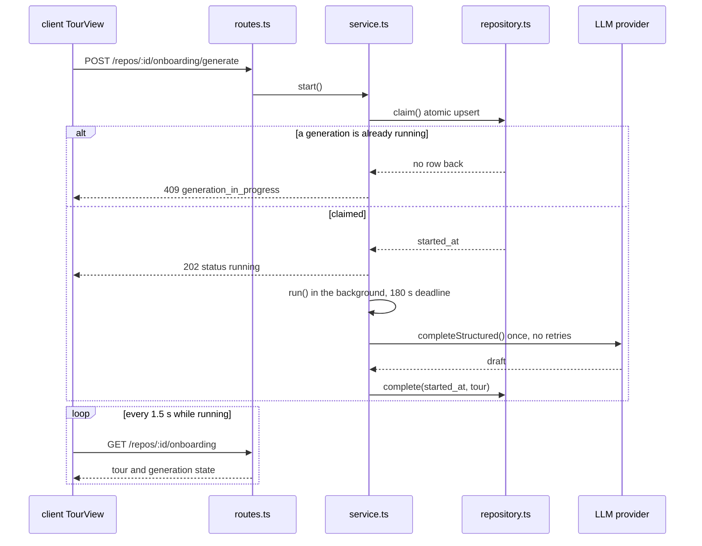
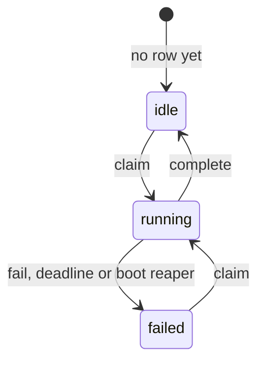

# Onboarding tour: how a generation runs

The onboarding tour gives a developer a five-part map of a repository they have never
worked in: architecture overview, critical paths, how to run locally, guided reading
path and first tasks. One model request writes the whole tour. This page explains how
that generation works across the server, the client and the e2e suite, and why it is
built this way. The spec is [`specs/11-onboarding-tour.md`](../specs/11-onboarding-tour.md);
the plan is [`plans/07-onboarding-tour.md`](plans/07-onboarding-tour.md).

## The pieces

| Piece | Where |
|---|---|
| Wire contracts (`Tour`, `TourRead`, `TourGeneration`, limits) | `server/src/vendor/shared/contracts/onboarding-tour.ts` (copied to the client) |
| Routes `GET /repos/:id/onboarding` and `POST /repos/:id/onboarding/generate` | `server/src/modules/onboarding/routes.ts` |
| Generation lifecycle | `server/src/modules/onboarding/service.ts` |
| Persistence (stored tour + generation state) | `server/src/modules/onboarding/repository.ts` |
| Draft → stored tour (path check, limits, image strip) | `server/src/modules/onboarding/tour.ts` |
| Page `/repos/:repoId/onboarding` | `client/src/app/repos/[repoId]/onboarding/` |
| Data hooks (poll while running) | `client/src/lib/hooks/onboarding-tour.ts` |
| Stub model and fixture repository for e2e | `server/src/adapters/llm/stub.ts`, `e2e/fixtures/` |

The tour lives in two tables. `onboarding` holds the last good tour as one JSON
document per repository. `onboarding_generations` holds the state of the current or
last generation, also one row per repository.

## The generation lifecycle

A click on Generate does not wait for the model. The server claims the generation,
answers `202` at once, and runs the work in the background. The page polls until the
state leaves `running`.

### The states

`GET` reports a repository with no generation row as `idle`. A running row blocks every
other `claim` for that repository, so two clicks or two tabs start one run.

### Rules the lifecycle follows

- **Claim is one statement.** `claim` inserts the row, or takes over a row that is not
  `running`, and returns the stored start time. No row back means a run is already in
  progress, and the route answers `409 generation_in_progress`. A repository without a
  checkout answers `409 repo_not_cloned` before the claim.
- **One model request, no retries.** The service sets `maxRetries: 0` and
  `transportRetries: 0`, so a wrong shape is never re-prompted and a network error is
  never retried by the provider SDK. A failed generation costs at most one request.
  `transportRetries` is an optional field of the structured request that the OpenAI,
  Anthropic and OpenRouter providers pass to their SDK; when it is unset, each provider
  keeps its own default.
- **180 s deadline.** The run races `GENERATION_TIMEOUT_MS` (`constants.ts`). On expiry
  the generation ends as `failed` with the text "Generation timed out".
- **Complete and fail are guarded.** Both match the row by `repo_id`, `started_at` and
  `status = 'running'`. A run that was already timed out, reaped or whose repository
  was deleted stores nothing. `complete` writes the tour and sets `idle` in one
  transaction.
- **A failure never destroys a tour.** `fail` touches only the generation row. The
  stored tour stays, and the page shows it with an error banner and a Retry button.
- **Boot reaper.** A generation runs inside the process that started it. When the API
  starts, `buildApp` marks every `running` row as `failed` ("Generation was interrupted
  by a server restart. Try again.") before it listens, next to the stale review run
  reaper in `server/src/app.ts`.
- **Fixed failure texts only.** The row never stores `err.message`. A person sees one
  of the strings in `constants.ts`: timeout, restart, missing API key for the chosen
  provider, or "The model could not produce a valid tour". Provider messages, raw model
  output and repository text never reach the page.

`POST /repos/:id/onboarding/generate` has its own rate limit of 10 per minute.

### What goes into the request

The service reads the checkout and the repo index, builds one prompt within a 30,000
token budget (`PROMPT_TOKEN_BUDGET`), and sends it with the schema name
`OnboardingTourDraft`. The model comes from Settings → Feature models → Onboarding Tour (default `openrouter` with the registry's default model).
Repository text is fenced as untrusted data in the prompt, and key and certificate
files are never read (`SECRET_FILE_PATTERN`). If the index ranks no files, the service
falls back to tracked source files and marks the tour `limited_index`.

### After the model answers

`buildTour` turns the draft into the stored tour:

1. It drops every critical path, reading entry and run step whose file is not tracked
   in the checkout, and counts them in `dropped_items`. Every file the tour names
   exists at the tour's commit. `first_tasks.scope` is text and is not checked.
2. It cuts each list to its limit (`TOUR_LIMITS`), after counting, so items cut for
   length are not counted as dropped.
3. It strips image embeds from the overview body, then cuts the body to 1,200
   characters.
4. It stamps the tour with the checkout's head commit, model, token counts and cost.
   The page footer shows model, tokens and cost.

## Image embeds are stripped twice

A model can write `` in the overview body, and
the page would fetch that URL when it renders. Model text must never choose a URL that
is fetched, so two places remove image syntax:

- **Server**, in `stripImageEmbeds` (`tour.ts`), before the body is stored. A markdown
  image becomes its alt text, and a raw `` tag is removed.
- **Client**, in `stripImageEmbeds` (`TourView/helpers.ts`), before the body is
  rendered and before it goes into "Copy as Markdown". The kit `Markdown` component
  renders `` as a real `` and has no override, so the page cannot rely on
  the server alone.

Both functions repeat until the text stops changing, so one removal cannot assemble a
new tag from the leftovers. The client function is a mirror, not an import: keep the
two in step when you change one.

## The stale badge

The page marks a tour stale when the repository has an indexed commit and that commit
differs from the tour's `commit_sha`. With no indexed commit there is no badge. The
tour's own commit is the head commit of the checkout at generation time, and the
indexed commit comes from the repo-intel index state (`useRepoIntelStatus`).

## Running it without a model (e2e)

The hermetic e2e run generates a tour with no network and no API key. Three pieces make
that work, all test-only:

- `DEVDIGEST_LLM_STUB` points to a JSON fixture. When set, `Container.llm()` returns a
  `StubLLMProvider` for every provider id, before any key lookup. The stub answers each
  `schemaName` from the fixture, validates the answer against the caller's schema, and
  reports fixed token and cost numbers. `loadConfig` refuses to start with this variable
  and `NODE_ENV=production`.
- `SEED_E2E_FIXTURE_PATH` makes `db:seed` add the fixture repository
  `devdigest-fixtures/tour-sample` with a fixed id, after the demo repository.
- `scripts/e2e-tour-fixture.sh` builds the git checkout that the path points to.

The variables, the fixture layout and flow 12 are described in
[`e2e/README.md`](../e2e/README.md); the server variables are in the
[server README](../server/README.md#environment).
