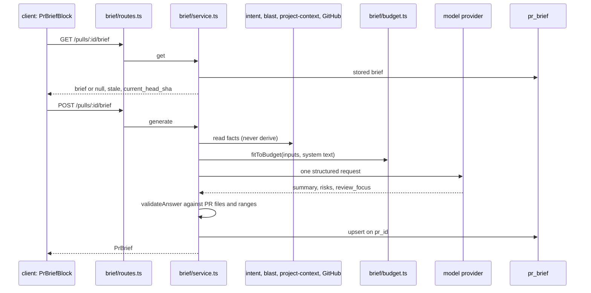

# PR Brief: how a brief is generated, checked and shown

The PR Brief answers three questions about a pull request you open cold: why
the change exists, what is risky in it, and which lines to read first. You ask
for it with one click on the Overview tab. One structured model call writes it.
The server checks every file and line the model names against the pull request,
then stores the result.

This page explains how that works across the server and the client. The spec is
[`specs/12-pr-brief.md`](../specs/12-pr-brief.md); the plan is
[`plans/08-pr-brief.md`](plans/08-pr-brief.md).

## The pieces

| Piece | Where |
|---|---|
| Wire contracts (`PrBrief`, `PrBriefResponse`, `Risk`, `ReviewFocusItem`, `BriefMissing`) | `server/src/vendor/shared/contracts/brief.ts` (copied to the client) |
| Routes `GET` and `POST /pulls/:id/brief` | `server/src/modules/brief/routes.ts` |
| Generation lifecycle, in-flight map, `missing` list | `server/src/modules/brief/service.ts` |
| Input budget (the fixed removal order) | `server/src/modules/brief/budget.ts` |
| Prompt rendering and per-input caps | `server/src/modules/brief/prompt.ts` |
| Answer validation and answer limits | `server/src/modules/brief/domain.ts` |
| Tunables (budget, model call) | `server/src/modules/brief/constants.ts` |
| Ports the container wires | `server/src/modules/brief/ports.ts`, `server/src/platform/container.ts` (`briefDeps`) |
| Persistence (`pr_brief`, one row per PR) | `server/src/modules/brief/repository.ts` |
| System prompt | `server/src/prompts/brief.system.md` |
| Candidate documents | `server/src/modules/project-context/service.ts` (`candidateDocuments`) |
| Hunk headers and new-side ranges; issue references | `server/src/modules/_shared/hunks.ts`, `server/src/modules/_shared/issue-refs.ts` |
| Data hooks | `client/src/lib/hooks/brief.ts` |
| Overview tab wiring | `client/src/app/repos/[repoId]/pulls/[number]/_components/OverviewTab/OverviewTab.tsx` |
| Block, Risk areas, Review focus | `_components/OverviewTab/_components/{PrBriefBlock,RiskAreas,ReviewFocus}/` |
| Jump to Files changed | `client/src/app/repos/[repoId]/pulls/[number]/use-diff-jump.ts`, `helpers.ts` (`parseDiffFocus`) |
| Landing on the file and line | `client/src/components/diff-viewer/` (`focus.ts`, `FileCard`, `CodeLine`) |

## Data flow

1. The read route returns the stored brief and never calls a model. A stored
   value that no longer matches the `PrBrief` contract reads as `null`.
2. The generate route is rate-limited to 10 per minute.
3. The service checks the pull request belongs to the workspace, then starts
   one generation per pull request. A second request for the same pull request
   joins the running promise instead of starting a second model call. The map
   lives in the API process, so this holds for one API instance only.
4. The service reads the facts other modules own. It never derives an intent
   for a brief. A read that fails leaves that input out and names it in
   `missing`.
5. `fitToBudget` shrinks the inputs until the request fits 8,000 tokens.
6. One `completeStructured` call runs with temperature 0, a 4,000-token output
   cap, a 60-second timeout and one schema re-ask.
7. `validateAnswer` removes everything the model could not ground (see below).
8. The service replaces the stored brief. A failed generation leaves the
   stored brief unchanged.

## What the model sees

The model request holds facts, never diff text. It carries:

- the pull request title and description (description cut to 6,000 characters);
- the stored intent: summary, in-scope items, out-of-scope items and risk-signal labels;
- the blast radius, when it names at least one changed symbol: summary, changed
  symbols, callers with file and line, affected endpoints and cron jobs;
- every changed file with additions, deletions and Smart Diff role group, plus at
  most 5 hunk headers per file, each cut to 120 characters;
- the linked issue, cut to 3,000 characters in total;
- attached project documents.

No added, removed or context line of a hunk enters the request. Every string
that comes from the repository, the pull request, the issue or the intent is
wrapped as untrusted data with `wrapUntrusted`, and the system prompt tells the
model to ignore instructions inside those blocks.

### Which issue

The server takes the first closing issue of the pull request. When there is
none, it takes the first same-repository `#N` reference in the title, the
description or the branch name. It makes at most two GitHub requests. Any
failure leaves the issue out and adds `issue` to `missing`.

### Which documents

The candidates are the project documents that at least one agent receives for
the repository, directly or through an enabled skill. They are ordered by the
number of receiving agents (highest first), then by path. The server reads them
from the repository's local clone and skips a document that is missing, larger
than 64 KiB or unreadable. A repository with no clone has no candidates.
The brief includes each document whole, in order, and skips any document that
would take the documents' total above 3,000 tokens.

## The input budget

The server counts the whole request, system text plus inputs, with its own
tokenizer. When the count is over 8,000 tokens, it removes inputs in a fixed
order and recounts after each step:

1. attached documents, from the last to the first;
2. the linked issue;
3. the description;
4. the blast callers;
5. every hunk header;
6. file rows outside the 50 files with the most changed lines;
7. file rows one at a time, fewest changed lines first.

If the request is still over with every file row gone, the budget removes the
blast radius, then the intent. A generation never fails because of input
size. Caps on titles, names, intent items and blast lists apply before
counting, so the limit is always reachable. The service fails only when the
trusted system text itself is over 1,500 tokens.

Each removal adds its value to the brief's `missing` list.

## How the answer is checked

The model answer must match `summary`, `risks[]` and `review_focus[]`. A
wrong risk `kind` or a missing key fails the answer; after the one re-ask, the
generation ends as failed. Length and count limits do not fail an answer. The
server trims it instead.

`validateAnswer` applies these rules in order:

| Rule | Limit |
|---|---|
| Keep the first risks | 5 |
| Keep the first review-focus items | 7 |
| Keep a `file_refs` entry only when it is a file of the pull request or, when the blast radius names a changed symbol, a changed-symbol file or a listed caller's file | exact string equality |
| Keep the first refs of each risk | 3 |
| Drop a risk with no ref left | n/a |
| Drop a review-focus item whose file is not a file of the pull request | n/a |
| Drop a review-focus item whose line lies outside every changed new-side range of its file | n/a |
| Cut texts on a word boundary: `summary`, risk `title`, risk `explanation`, focus `reason` | 400, 80, 400, 160 characters |

A review-focus line may only lie in a changed range, so a model-invented path
or line never reaches the screen. A path from the model is only compared with
the pull request's file list; the server never uses it to read or link
anything.

## What is stored

One `pr_brief` row per pull request holds the brief as JSON:

| Field | Meaning |
|---|---|
| `summary`, `risks[]`, `review_focus[]` | the validated answer |
| `head_sha` | the head commit the brief was generated for |
| `generated_at` | ISO timestamp |
| `provider`, `model` | what produced it |
| `tokens_in`, `tokens_out`, `cost_usd` | usage; `cost_usd` is `null` when the price is unknown |
| `missing[]` | inputs the brief lacks or had trimmed |

The repository drops the legacy `intent`, `blast` and `history` members of the
old composed contract on read and on write. The Intent and Blast radius cards
keep reading their own endpoints.

### The `missing` list

| Value | Meaning |
|---|---|
| `intent` | no stored intent |
| `intent_stale` | the stored intent is for another head SHA (dropped when `intent` is set) |
| `blast` | the blast radius names no changed symbol (or was removed as a last resort) |
| `issue` | no linked issue found or readable |
| `specs` | no project document is in the request |
| `description` | the description is empty |
| `specs_trimmed`, `issue_trimmed`, `description_trimmed`, `callers_trimmed`, `hunks_trimmed`, `files_trimmed` | that input was cut to fit the budget |

## Stale and the model choice

`stale` is true exactly when the stored brief's `head_sha` differs from the
pull request's current head SHA. It is the only stale signal. A re-derived
intent, a rebuilt index or an edited description does not mark a brief stale.
The client keys the read query on the pull request's head SHA, so a push
refetches it.

The model comes from the workspace's `risk_brief` feature setting. When the
workspace has not chosen one, the default is the provider `openrouter` with
the model `deepseek/deepseek-v4-flash`. The default is set in
`server/src/vendor/shared/contracts/platform.ts` and its client copy
`client/src/lib/feature-models.ts`.

## How the client behaves

`OverviewTab` renders, top to bottom: the PR Brief block, the Intent and Blast
radius cards side by side, the Risk areas list, the Review focus list and the
description.

- **No brief.** The block shows "No brief yet" and a Generate brief button.
  While the read is pending or has failed, the block shows a skeleton or a
  load error with Retry. It never offers a paid generation in those states.
- **Generating.** The summary, Risk areas and Review focus show skeletons, and
  the Generate and refresh controls stay disabled. `useGenerateBrief` keys its
  mutation and derives `generating` from `useIsMutating`, not from its own
  observer. The Overview tab can unmount while the POST runs; a remounted block
  still sees the run in flight. `onSettled` refetches the stored brief for
  success and failure alike.
- **A brief.** The banner shows the summary as plain text and a refresh control.
  When the pull request has a review, the banner also shows the latest round's
  verdict (the most severe of the round: request changes, comment, approve),
  finding count, blocker count and the PR score from the pull-request list.
  The notice names every `missing` entry in words. The footer shows the first 7
  characters of `head_sha`, provider, model, token counts and cost.
- **Stale.** The block keeps the stored brief and adds "Generated for `<sha>`,
  the PR has new commits".
- **Failure.** With no stored brief, an error state with Retry replaces the
  empty state. With a stored brief, the block keeps it and shows an inline
  error. When the chosen provider has no API key (`config_error`), the error
  names the provider and links to `/settings/api-keys`.

`VERDICT_META` (verdict colour, icon and label key) lives in
`client/src/app/repos/[repoId]/pulls/[number]/constants.ts`, shared by the
banner and the verdict banner.

### Jump to Files changed

A click on a Review focus item, or on a risk's file reference, calls
`useDiffJump`. It makes one `router.push` to `?tab=diff&file=<path>&line=<n>`,
so Back returns to the Overview. A file reference that is not a file of the
pull request does not navigate; a transient message says "File not in this
PR's diff".

On the Files changed tab, `parseDiffFocus` accepts the URL values only when
`file` is a file of the pull request and `line` is a positive integer. Then:

- the file's role group opens, and the file's card expands and gets the accent border;
- the page scrolls the line into view when the file shows it on its new side,
  otherwise the file header;
- the line is highlighted for about 2 seconds.

`DiffFocus` and `focusKey` are exported from
`client/src/components/diff-viewer/focus.ts`. A manual collapse is remembered
together with the focus it was made under, so a new jump opens the file again.

## Safety notes

- Model text is shown as plain text. Only a risk's explanation goes through the
  kit `Markdown` component, after `stripImageEmbeds` removes image embeds, so
  model text never chooses a URL the browser fetches.
- The server logs one line per generation with ids, counts and the outcome,
  and no text.
- A failed model call reaches the caller as one fixed reason (`timeout`,
  `rate_limited`, `rejected`, `invalid_answer`, `request_failed`), never as
  provider text. A missing key is the exception: it is a `config_error` that
  names the provider.

## Known limits

- A brief is generated only on request: not on opening a pull request, not
  after a push, not after a review.
- The in-flight map is per API process. Two API instances would run two calls.
- "Prior PRs touching these files" is not computed, and no MCP tool exposes the
  brief.
- The brief module has no tests of its own yet, and no e2e flow covers it.
