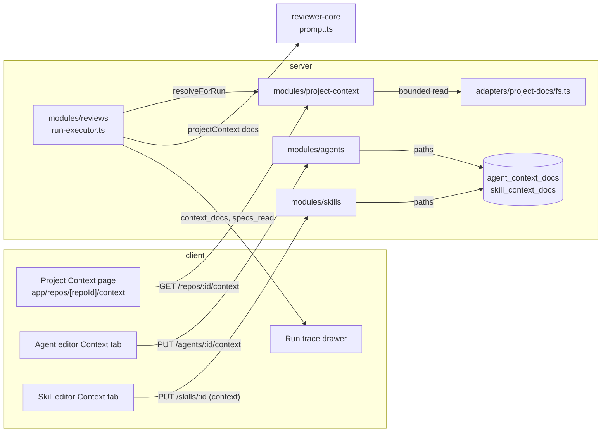
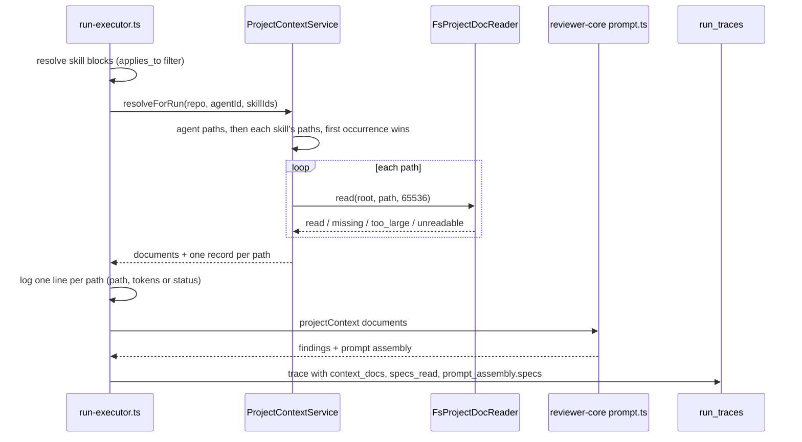

# Project Context — repository documents in a review

Project Context lets a reviewer agent read the markdown documents of the repository it
reviews: specifications, architecture notes, incident write-ups. You attach documents to an
agent or to a skill by hand. Every review run of that agent then carries their text in the
prompt, as data the model must not obey, and the run trace shows what was read.

The feature adds no model call and makes no network request. It reads the repository's local
checkout only.

Spec: [specs/10-project-context.md](../specs/10-project-context.md). Plan:
[plans/06-project-context.md](plans/06-project-context.md).

## What a project document is

A project document is a git-tracked file of the repository's local default-branch checkout
that matches one fixed pattern:

```
**/{specs,docs,insights}/**/*.md
```

- The pattern is a constant, not a setting (`server/src/modules/project-context/constants.ts`).
  The API returns it with every list so the UI can show it.
- A hand-written matcher applies it. It accepts a path when a directory segment is `specs`,
  `docs` or `insights` and the file name ends in `.md` (case-sensitive)
  (`server/src/modules/project-context/helpers.ts`).
- The type of a document is the first of those three names you meet reading the path from the
  left. `packages/api/specs/docs/x.md` is `specs`.
- The list skips symbolic links, because the git listing drops entries of mode `120000`
  (`server/src/adapters/git/simple-git.ts`).
- The list is sorted by path and is never cached. Pull the repository, resync it, and the next
  request shows the new files.

A repository that is added but not yet cloned returns `cloned: false` and an empty list.

## Where it lives



- `modules/project-context` owns discovery, previews and the resolution of a run's documents.
  It reaches the agents and skills repositories and the file reader through ports
  (`server/src/modules/project-context/ports.ts`).
- Agents and skills call it through the structural `ProjectDocsLister` port to validate paths
  (`server/src/modules/_shared/ports.ts`). The review executor calls it through
  `ProjectContextPort` (`server/src/modules/reviews/deps.ts`).
- `container.projectContextService` wires all of it (`server/src/platform/container.ts`).

## Attachments

An attachment list is the ordered list of repository-relative paths attached to one agent or
one skill for one repository. The database stores paths and positions only, never document
text (`server/src/db/schema/agents.ts`, `server/src/db/schema/skills.ts`). Deleting an agent,
a skill or a repository deletes its lists (`ON DELETE CASCADE`).

| You do | Request | What the server does |
|---|---|---|
| Attach, detach or reorder on an agent | `PUT /agents/:id/context` with `{ repo_id, paths }` | Replaces the whole list. Creates a new agent version only when the ordered list changed |
| Save a skill | `PUT /skills/:id` with `context: { repo_id, paths }` beside the other fields | Replaces the list in the same transaction as the skill update. Never changes the skill version |
| Read an agent's list | `GET /agents/:id/context?repo_id=` | Returns `paths` and `inherited` (documents of the agent's enabled skills, each with the skill name) |
| Read a skill's list | `GET /skills/:id/context?repo_id=` | Returns `paths` |

Validation applies to both owners (`server/src/modules/_shared/context-docs.ts`):

- A path may appear only once.
- A path must be a current project document of the repository, unless it is already stored in
  that list. A stored path that is no longer a document (deleted or renamed) stays until you
  detach it, so you can still save other changes. The editors show it as a `missing` row.

The agent tab saves on every change, with no save button. It shows the change at once and
returns to the last saved list, with an error toast, if the save fails
(`client/src/lib/hooks/project-context.ts`). The skill tab keeps the list as part of the
skill's unsaved draft and sends it with the next Save
(`client/src/app/skills/_components/SkillDetail/SkillDetail.tsx`).

When no repository is active, both tabs show only the empty state "Select a repository to
attach project context". The skill tab then leaves its stored lists alone on Save.

### Used-by and the token total

- `used_by` for a document is the number of distinct agents of the workspace that receive it,
  either by direct attachment or through a skill that is enabled and bound as enabled
  (`contextUsedBy` in `server/src/modules/agents/repository.ts`).
- Token counts come from the server's tokenizer and are computed from the full file, on every
  list request. The page, both tabs, the preview drawer and the trace use the same number for
  an unchanged file. A file that cannot be read shows `0`.
- The agent tab's total counts directly attached and inherited documents once each. Above 4,000
  tokens it shows an "over 4K soft cap" badge. The cap is a warning only: attaching still works
  (`client/src/components/context-docs/constants.ts`).

The agent tab lists every inherited document of an enabled skill. It does not evaluate the
skill's `applies_to` patterns, so a document can show as inherited on the tab and still be left
out of a run (see below).

## What a run does



1. **Order.** The run's document list is the agent's own list for the pull request's repository,
   followed by the list of each skill that reached the prompt, in skill order. A path that
   repeats keeps only its first position. A skill skipped because its `applies_to` patterns
   match no changed file contributes nothing
   (`server/src/modules/project-context/service.ts`, `server/src/modules/reviews/run-executor.ts`).
2. **Read.** Each path is read from the local default-branch checkout as it stands when the run
   starts. Nothing is fetched. A pull request that edits an attached document does not change
   what the run reads.
3. **Skip, don't fail.** A document that cannot be used gets a status and the run continues:

   | Status | Cause |
   |---|---|
   | `missing` | The file is not in the checkout |
   | `too_large` | More than 65,536 bytes |
   | `unreadable` | Empty, not a regular file, contains a NUL byte, is not valid UTF-8, or resolves outside the checkout |

4. **Prompt.** When at least one document was read, the prompt gets one `## Project context`
   section. Each document is its own `<untrusted source="project-context">` block whose first
   line is `### <path>`, followed by the full text. Any closing tag in the path or text is
   escaped, so a document cannot end its own block. After the blocks, outside every fence, one
   trusted line (`PROJECT_CONTEXT_RULE`) asks the model to name in a finding the path of the
   document it relied on (`reviewer-core/src/prompt.ts`). When no document was read, the section
   and the line are absent.
5. **Trace.** The run stores one record per document of the run's list (`path`, `status`,
   `tokens`), the paths that were read in `specs_read`, and the exact project-context text in
   `prompt_assembly.specs`. A failed or cancelled run that got past the read step still stores
   the records. It does not store the prompt text (`server/src/modules/reviews/run-executor.ts`).
6. **Live log.** One line per document: path and token count for a read document, path and
   status for a skipped one. Log lines never carry document text.

### What you see in the trace drawer

- The "Specs read" row lists each read document with its token count and each skipped one with
  its status, plus "Project context adds N tokens to the prompt". It shows `none` when the trace
  has no records and no read paths.
- Prompt assembly gets a row "Project context — attached specs (untrusted)" with the full text.
- A trace stored before this feature has no `context_docs`. It shows its `specs_read` paths, or
  `none`, and no project-context row (`client/src/app/repos/[repoId]/pulls/[number]/_components/RunTraceDrawer/_components/TraceBody/TraceBody.tsx`).

## The Project Context page

`/repos/:repoId/context`, under WORKSPACE in the sidebar, is read-only. It lists every document
with its path, type, `≈ N tokens` and "Used by N agents", shows the pattern in effect, and
renders the selected document as markdown. A refresh control re-reads the checkout; it does not
fetch from GitHub (use the existing resync for that). The page has loading, error with retry,
not-cloned and "No documents found" states. It has no control that creates, edits, uploads or
deletes a file: the checkout is overwritten by a resync, and an edit that matters needs a commit
and a push.

## Known limits

- **Symbolic links at run time.** The list and content endpoints drop symbolic links. A run does
  not: it reads a stored path through the bounded reader, which resolves links and follows one
  whose target stays inside the clone root (`server/src/adapters/project-docs/fs.ts`). A path
  that was a regular file when you attached it and became an in-repo link later is read through
  the link. A link that resolves outside the clone is `unreadable`.
- **Remote images in previews.** Repository markdown is rendered through the shared `Markdown`
  primitive. It does not run raw HTML, but it still loads remote images
  (`client/src/vendor/ui/primitives/Markdown.tsx`). Opening a preview of a document that embeds a
  remote image makes your browser request it.
- **Default branch as held locally.** Previews, token counts and runs all use the local
  checkout. If it is behind GitHub, they are behind too. The pull request's own version of a
  document is never read.
- **No size limit on the total.** Only the 4,000-token warning exists. A run sends every
  readable document.
- **Not carried elsewhere.** Attached paths are not part of skill import, skill export or CI
  export.
- **No automated tests yet.** The feature shipped without new tests. The deterministic e2e flow
  (NFR-11 of the spec) is deferred to a follow-up plan, and the spec stays `approved` until it
  lands. The verification scenario AC-72 (a real model names the document in a finding) is a
  manual check.
