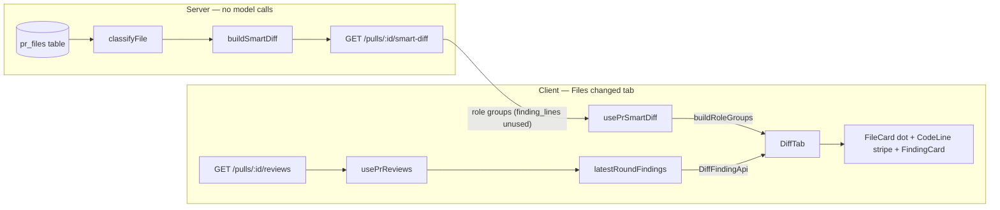

# Smart Diff: the file classifier and the Files changed data flow

Smart Diff groups a PR's changed files into five roles — core, tests, wiring, docs,
boilerplate — behind `GET /pulls/:id/smart-diff` (spec `specs/09-smart-diff.md`). This
page is the reference for `classifyFile`, the pure function that assigns a role, and
for how the Files changed tab combines that grouping with a separate findings source.
Read it before reusing the classifier as a pre-prompt filter (L08) or before adding a
classification rule.

## The classifier

`classifyFile(path)` (`server/src/modules/smart-diff/classify.ts`) is a pure function:
no I/O, no HTTP, no database. It walks `CLASSIFY_RULES`
(`server/src/modules/smart-diff/constants.ts`) in order and returns the role of the
**first** rule whose patterns match; a path matching nothing falls back to `core`.

Patterns use the gitignore-like matcher in `server/src/modules/_shared/glob.ts`
(`matchesAny`), shared with the review diff-exclusion filter
(`server/src/modules/reviews/diff-filter.ts`). A bare literal with no `/` and no
wildcard matches only that exact full path — prefix a file name with `**/` (for
example `**/pnpm-lock.yaml`) so it matches at any depth.

### Check order (first match wins)

| Order | Role | Sample patterns | Notes |
|---|---|---|---|
| 1 | `boilerplate` | `*.lock`, `**/pnpm-lock.yaml`, `**/__snapshots__/**`, `*.snap`, `*.g.dart`, `**/generated/**` | Checked first, so a snapshot file nested inside `__tests__/` classifies as `boilerplate`, not `tests`. |
| 2 | `tests` | `**/*.test.ts`, `**/*.it.test.ts`, `**/__tests__/**`, `**/test/**`, `e2e/**` | `e2e/**` matches `e2e/README.md` as `tests` before the `docs` rule (order 4) ever sees it. |
| 3 | `wiring` | `**/index.ts`, `*.config.*`, `.github/**`, `.claude/**`, `**/package.json`, `**/pubspec.yaml` | Checked before `docs`, so `.claude/**` markdown (agent skill files) classifies as `wiring`, not `docs`. Dependency manifests (`package.json`, `pubspec.yaml`) are `wiring` — they hook a dependency into the app, they aren't the substance of the change; their lock files still hit the `boilerplate` rule first. |
| 4 | `docs` | `**/*.md`, `**/docs/**`, `README*`, `LICENSE*` | Reached only when nothing above matched. |
| — | `core` (fallback) | none | Every path that matches no rule — the substance of the change. |

### Why order beats patterns

The three contested cases only make sense because of check order, not pattern
specificity:
- `src/__tests__/__snapshots__/x.snap` → `boilerplate`, because the boilerplate rule
  is checked before the tests rule, even though the path also matches `**/__tests__/**`.
- `.claude/skills/security/SKILL.md` → `wiring`, because the wiring rule is checked
  before the docs rule, even though the path also matches `**/*.md`.
- `e2e/README.md` → `tests`, because the tests rule (`e2e/**`) is checked before the
  docs rule, even though the path also matches `**/*.md`.

If you ever need a file to classify differently, move its rule earlier or later in
`CLASSIFY_RULES` before you touch the pattern — the order is the mechanism.

## Adding a rule

1. Edit `CLASSIFY_RULES` in `server/src/modules/smart-diff/constants.ts`. Decide which
   existing rule your new pattern must be checked before or after — read the comment
   at the top of the check-order block first.
2. Add a row to the table test in `server/test/smart-diff-classify.test.ts` for every
   path your change affects, including any existing case whose role would flip.
3. If you touched `SMART_DIFF_ROLE_ORDER` (the five roles, not the check order), the
   test asserting it equals `SmartDiffRole.options` as a set will catch a mismatch.
4. Run `pnpm test:unit` in `server/`.

`SMART_DIFF_ROLE_ORDER` (display order: core → tests → wiring → docs → boilerplate)
and `CLASSIFY_RULES` (check order) answer two different questions and live in the same
file on purpose — don't conflate them when reading or editing `constants.ts`.

## Importing the classifier without HTTP

`server/src/modules/smart-diff/index.ts` is the module's public surface for other
server code (onion-architecture: cross-module access only through a module's
`index.ts`). It re-exports exactly `classifyFile`, `SMART_DIFF_ROLE_ORDER` and
`CLASSIFY_RULES` — no service, no repository, no route.

```ts
import { classifyFile } from "../smart-diff/index.js";

const role = classifyFile("client/src/components/diff-viewer/index.ts"); // "wiring"
```

Because `classifyFile` is pure, any server module can call it directly with a path
string — no container, no Fastify request context, no database connection. This is
the shape the L08 reviewer-prompt filter is expected to use: call `classifyFile` on
each changed path before building the LLM context, without depending on the
`smart-diff` route or its service.

## Grouping never calls a model

`GET /pulls/:id/smart-diff` (`server/src/modules/smart-diff/routes.ts`) resolves to
`SmartDiffService.forPull` (`service.ts`), which has no LLM, GitHub or git dependency:
it reads `pr_files`, `agent_runs`, `reviews` and `findings` through
`SmartDiffRepository` (plain Drizzle selects, `repository.ts`) and passes the results
to `buildSmartDiff` (`build.ts`), a pure function that only calls `classifyFile` and
does arithmetic. That's the structural guarantee that Smart Diff groups a PR's files
before any review has run, and that grouping never shows up as a model call in the
logs.

## Files changed tab: two independent data sources

`DiffTab` (`client/src/app/repos/[repoId]/pulls/[number]/_components/DiffTab/DiffTab.tsx`)
combines two calls that never talk to each other:

- **Role groups** come from `usePrSmartDiff(prId)` (`client/src/lib/hooks/core.ts`),
  which calls `GET /pulls/:id/smart-diff`. `buildRoleGroups`
  (`DiffTab/helpers.ts`) turns the response into `{ role, files }[]`, re-sorted into
  GitHub's own file order (the server's in-group order is unspecified — `pr_files`
  has no order column).
- **Findings** — the dot on a file card, the severity stripe and label on a line, the
  inline `FindingCard`, the group counter — all come from one function:
  `latestRoundFindings(reviews)` (`client/src/lib/latest-round-findings.ts`), fed by
  `usePrReviews(prId)`. It picks out the PR's latest review *round* (every agent
  started by one Run Review click, sharing one `agent_runs.batch_id`) the same way
  the PR list's finding counters do, so the two views can never disagree.
  `latestRoundFindings` has a second caller, `FindingsCell` on the PR list, which is
  why it's a shared helper in `client/src/lib` rather than living inside `DiffTab`.

The `SmartDiff` response also carries `finding_lines` per file
(`server/src/modules/smart-diff/build.ts`), computed from the same "latest round"
rule on the server (`server/src/modules/_shared/latest-round.ts`). **The client never
reads `finding_lines`.** It exists to satisfy the `SmartDiff` contract and as the
future read path for the L08 reviewer filter; the UI's only findings source is
`latestRoundFindings(reviews)`. Don't treat the two as duplicates that must be kept
in sync by hand — they're independent computations of the same rule, one per package.

`components/diff-viewer` never imports `FindingCard` directly (client eslint forbids
`components/` importing `src/app`). `DiffTab` passes a `DiffFindingApi`
(`client/src/components/diff-viewer/findings.ts`) down through `RoleGroup` →
`DiffViewer` → `FileCard` → `CodeLine`, with a `renderFinding` slot that `DiffTab`
fills with `<FindingCard>`.



## See also

- `specs/09-smart-diff.md` — goal, scope, acceptance criteria.
- `docs/plans/03-smart-diff.md` — user decisions and design notes behind the choices
  above (dependency-manifest role, empty-group handling, comments-toggle default).
- `server/INSIGHTS.md` (2026-09-26 entries) — the glob matcher's move to
  `_shared/glob.ts` and why `smart-diff/service.ts` imports the "latest round" rule
  from `_shared/latest-round.ts` instead of `pulls/index.ts`.
- `client/INSIGHTS.md` (2026-09-26 entries) — the `renderFinding` slot, the comments
  toggle default, and the sticky group header's `--pr-header-h`.
