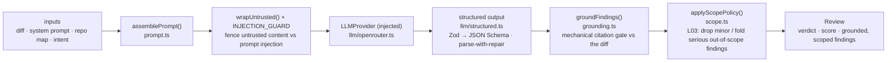

# `@devdigest/reviewer-core` — the review engine

Pure review logic: **diff → prompt → LLM → grounded findings**. No database,
GitHub, or filesystem; the only side effect is an LLM call through an **injected**
`LLMProvider`, which is what makes it mock-testable.

In the starter the **server** (`@devdigest/api`) is its only consumer — for local
reviews in the studio. (The CI runner that runs the same engine in GitHub Actions
is added back in the Export-to-CI lesson, L06.) The server wires it via a tsconfig
path alias (`@devdigest/reviewer-core` → `../reviewer-core/src`) and consumes the
TypeScript **source** directly (tsx in dev, vitest in tests). The package never
emits JS — its `build` is a type-check.

## Pipeline

The grounding step is the mandatory gate: a finding that doesn't cite a real line
in the diff is dropped, so the engine can't hallucinate locations. The scope
policy (L03) runs strictly AFTER grounding, on grounded findings only: below
`scopeFilter.minSignalSeverity` an out-of-scope finding is dropped (reason
`out_of_scope`); at or above it, every out-of-scope finding at/above that
severity in the run is folded into exactly ONE `kind: 'out_of_scope'` signal
finding (max severity, anchored at the top folded finding, its rationale lists
every folded finding). It never re-judges severity and is the identity
transform when `scopeFilter` is undefined (no intent, low tier, or a stale
intent — see the server's `INTENT_LIMITS`/`pr_intent`). The score is
recomputed deterministically from the **surviving, scoped** findings, not
trusted from the model. `review/run.ts` orchestrates the run (single-pass by
default).

The engine also accepts optional prompt slots the **course lessons** start
feeding it — `skills` (L02, fed by the server: one `### Skill: <name>` block per enabled skill), `memory` (L07), `specs` (L05), `callers`,
`intent` (L03: the derived-intent block, fenced and capped at 1500 chars,
rendered right after `## PR description` and followed by the trusted,
un-fenced `INTENT_SCOPE_RULE` — a finding's `scope` tag never changes its
severity or justifies dropping it; only `scope.ts`'s deterministic policy
does that) — plus a `reduce()`/map-reduce path and a `toReview()` CI payload
helper used from L06. The server passes the diff, system prompt, repo map,
the agent's skills (L02) and, since L03, the PR's derived intent; other slots
are omitted, so `assemblePrompt` simply leaves those sections out.

## Public API

Exported from `src/index.ts`: `assemblePrompt` / `wrapUntrusted` /
`INTENT_SCOPE_RULE` (prompt), `groundFindings` / `groundingSummary`
(grounding), `applyScopePolicy` (scope, L03), `toJsonSchema` / `extractJson`
/ `parseWithRepair` (structured output), plus the `run` entrypoint and
`reduce`. Contracts (`Review`, `Finding`, `Verdict`, …) come from
`@devdigest/shared`.

## Testing

`npm test` (vitest) — hermetic units with a stubbed `LLMProvider`: prompt
assembly (including the `intent` slot, `test/prompt.test.ts`), the scope
policy (`test/scope.test.ts`), the grounding gate, `toReview` selection, and a
full `run` (including a map-reduce run where every chunk carries the intent,
and that the score is computed after the scope policy, `test/run.test.ts`). No
keys, no network. `npm run typecheck` doubles as the build. See
[`../TESTING.md`](../TESTING.md).
