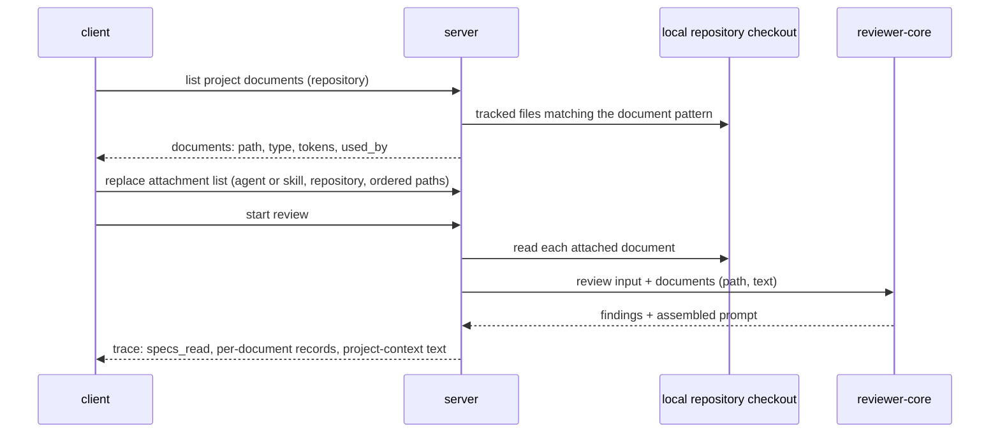

# Spec: Project Context
Spec ID: SPEC-10
Status: approved
Supersedes: none
Packages: server, client, reviewer-core, e2e
Sources: user brief and lesson L05 requirements ("Project Context Folder") · four screenshots (Project Context page N6, agent editor Context tab, skill editor Context tab, run trace drawer) · design files in client/docs/design (context_docs, data_context, screen_tour_context, screen_agents, screen_skills, screen_trace, data2, chrome) · specs/03-skills.md · specs/08-intent-layer.md · user answers to the discovery questions (Q1–Q13, proposals P1–P7 accepted)
Amended: 2026-10-04 — AC-73, AC-74, AC-75, AC-76, AC-77, AC-78, EC-22, EC-23 and EC-24 added: Context tabs with no active repository (gap found during implementation, decided by the user)
Amended: 2026-10-04 — AC-29, EC-4 and the untrusted-input row "Paths in attachment requests" reworded; EC-21 added (gap found by implementation-planner, decided by the user)

## Problem and user
A developer who reviews pull requests with DevDigest agents keeps the project's rules in markdown
documents inside the repository: specifications, architecture notes, incident write-ups. The
reviewer agents never see those documents, so a pull request that breaks a written rule passes
review unless the rule was copied by hand into an agent's system prompt or a skill. The developer
cannot tell whether a spec changes the reviewer's behaviour, cannot see what a document would add
to the prompt, and cannot check afterwards which documents a run actually used.

## Goals / Non-goals
**Goals**
- The developer finds every markdown document of the repository's document folders in the studio and reads it there.
- The developer attaches chosen documents to an agent or to a skill by hand, per repository, and sees how many tokens they add to each prompt before running anything.
- Every review run of that agent carries the text of the attached documents as data the model must not obey, and the reviewer names the document a finding relies on.
- The run trace shows which documents were read, their size in tokens, which were skipped and why, and the full text that was added to the request.
- The feature adds no model call.

**Non-goals**
- Editing a document from the Project Context page — the files live in a runtime checkout of the default branch that a resync overwrites, and an edit that matters to anyone else needs a commit and a push to GitHub (a new write scope, outward-facing). The page is view-only.
- Creating a file, creating a folder and uploading a file from the page — same reason as editing.
- The coverage ring and the "chunks" indexing footer of the design — this feature has no data behind them.
- Automatic selection of documents by pull-request content — the lesson keeps selection manual; an automatic selector is a separate feature.
- Attaching documents from the Project Context page — attaching stays in the agent editor and the skill editor.
- Reading the pull request's own version of a document, or fetching the repository before a run — the user chose the simplest behaviour: the default branch as currently held locally.
- Recording in the trace the commit the documents were read from — dropped by the user's decision ("not needed") unless it comes for free.
- A hard limit on the total size of attached documents — the user chose a warning only.
- Carrying attached paths through skill import, skill export and CI export — not requested.
- PR Brief and the Onboarding generator — other L05 features with their own specs.

## User stories
- US-1: As a developer reviewing pull requests, I want to browse and read the repository's markdown documents in the studio, so that I know which documents exist before I attach any.
- US-2: As a developer configuring an agent, I want to attach repository documents to the agent, so that its reviews check pull requests against them.
- US-3: As a developer maintaining a skill, I want to attach repository documents to the skill, so that every agent using the skill inherits them.
- US-4: As a developer configuring an agent or a skill, I want to see how many tokens the attached documents add, so that I know the cost added to each prompt.
- US-5: As a developer reading a review, I want findings to name the project document they rely on, so that I can tell whether a spec changed the reviewer's behaviour.
- US-6: As a developer inspecting a run, I want the trace to list the documents read with their token sizes and to show the full text added to the request, so that I can verify what the model received.

## Workflow and module interactions

What crosses the boundaries (wire spelling):
- **Document list item** (server → client): `path` (repository-relative), `type` (`specs` | `docs` | `insights`), `tokens`, `used_by` (number of agents). The document pattern in effect travels with the list.
- **Document content** (server → client): the text of one project document, for preview.
- **Attachment list** (client ↔ server): for one agent or one skill and one repository, an ordered list of repository-relative paths. Paths only, never document text.
- **Run input** (server → reviewer-core): an ordered list of documents, each with its path and its text.
- **Run trace** (server → client): `specs_read` — the paths of the documents that were read, in prompt order; a per-document record list with `path`, `status` (`read` | `missing` | `too_large` | `unreadable`) and `tokens`, absent on traces stored before this feature; `prompt_assembly.specs` — the full project-context text sent to the model.

## Acceptance criteria (EARS)

**Discovery**
- AC-1 (US-1): The server shall treat as the project documents of a repository the git-tracked files of its local default-branch checkout whose repository-relative path matches the configured document pattern.
- AC-2 (US-1): WHERE no document pattern is configured, the server shall use the pattern `**/{specs,docs,insights}/**/*.md`.
- AC-3 (US-1): The server shall give each project document the type `specs`, `docs` or `insights`, taken from the first segment of its path, read from the left, that equals one of those three names.
- AC-4 (US-4): The server shall report one token count for each project document, computed from the document's full content.
- AC-5 (US-4, US-6): The Project Context page, both Context tabs, the preview drawer and the run trace shall show the same token count for a document whose content has not changed.
- AC-6 (US-1): The server shall report for each project document a used-by count equal to the number of agents that receive the document for that repository, either by direct attachment or through an enabled skill.

**Project Context page**
- AC-7 (US-1): The sidebar shall show an entry "Project Context" in the WORKSPACE section that opens the Project Context page of the active repository.
- AC-8 (US-1, US-4): WHEN the user opens the Project Context page, the client shall list every project document of the repository with its repository-relative path, type badge, token count as "≈ N tokens" and used-by count as "Used by N agents".
- AC-9 (US-1): The Project Context page shall show the document pattern in effect in its header.
- AC-10 (US-1): WHEN the user selects a document on the Project Context page, the client shall show that document's content rendered as markdown.
- AC-11 (US-1): The Project Context page shall offer no control that creates, edits, uploads or deletes a document.
- AC-12 (US-1): WHILE the document list is loading, the client shall show a loading placeholder in place of the list.
- AC-13 (US-1): IF the document list request fails, THEN the client shall show an error state with a retry control.
- AC-14 (US-1): IF the repository has no local checkout, THEN the client shall show a state saying the repository has not been cloned yet.
- AC-15 (US-1): IF the repository has no project documents, THEN the client shall show an empty state titled "No documents found" whose body names the document pattern in effect.
- AC-16 (US-1): WHEN the user activates the refresh control on the Project Context page, the client shall show the project documents as found in the current local checkout at that moment.

**Context tabs (agent editor and skill editor)**
- AC-17 (US-2): The agent editor shall show a tab "Context" directly after its "Skills" tab.
- AC-18 (US-3): The skill editor shall show a tab "Context", directly after its "Config" tab, whose heading is "Project context to use".
- AC-19 (US-2, US-3): WHEN the user opens a Context tab, the client shall list every project document of the active repository as a row with a checkbox, the repository-relative path, the type badge and a Preview control.
- AC-20 (US-2, US-3): The Context tab of each editor shall name the repository whose documents it lists.
- AC-21 (US-2, US-3): The server shall store one ordered attachment list per agent per repository and one ordered attachment list per skill per repository.
- AC-22 (US-2, US-3): The Context tab of each editor shall show attached documents first, in their stored order, followed by unattached documents in ascending path order.
- AC-23 (US-2, US-3): WHEN the user types in the "Filter documents…" field of a Context tab, the client shall show only the documents whose path contains the typed text, ignoring letter case.
- AC-24 (US-2, US-3): WHEN the user activates a row's Preview control, the client shall open a drawer showing the document's path, type badge, used-by count, token count, markdown-rendered content and an attach toggle.
- AC-25 (US-2, US-3): WHEN the user drags an attached row to another position among the attached rows, the client shall place the document at that position in the attachment list.
- AC-26 (US-2, US-3): WHEN the user presses ArrowUp or ArrowDown on the reorder handle of an attached row, the client shall move the document one position in that direction in the attachment list.
- AC-27 (US-2, US-3): The client shall offer no reorder control on an unattached row.
- AC-28 (US-2, US-3): IF an attached path is not among the repository's project documents, THEN the Context tab shall show the path as a row marked "missing" whose only control detaches it.
- AC-29 (US-2, US-3): IF a request stores an attachment list containing a path that is neither in the attachment list already stored for the same agent or skill and repository nor a project document of that repository, THEN the server shall reject the request with a validation error.
- AC-73 (US-2, US-3): WHILE no repository is active, the Context tab of each editor shall show the studio's standard empty state, with no action control, whose text is "Select a repository to attach project context".
- AC-74 (US-2, US-3): WHILE no repository is active, the Context tab of each editor shall show no document list, no filter field, no attach control and no token total.
- AC-75 (US-2): WHILE no repository is active, the agent Context tab shall show no attached-count badge, no repository name and no inherited "via skill" row.
- AC-76 (US-3): WHILE no repository is active, the skill Context tab shall show, apart from the empty state, only its heading "Project context to use".
- AC-77 (US-3): WHILE no repository is active, the skill Context tab shall leave the skill's unsaved-changes mark unchanged.
- AC-78 (US-3): WHILE no repository is active, WHEN the user saves the skill, the server shall leave every stored attachment list of the skill unchanged.

**Agent Context tab**
- AC-30 (US-2): The agent Context tab shall show a badge "N of M attached", where N is the number of documents attached to the agent for the active repository and M is the number of project documents.
- AC-31 (US-2): WHEN the user attaches a document on the agent Context tab, the server shall store the document's path as the last entry of the agent's attachment list for the active repository, with no separate save action.
- AC-32 (US-2): WHEN the user detaches a document on the agent Context tab, the server shall remove the document's path from the agent's attachment list for the active repository, with no separate save action.
- AC-33 (US-2): IF saving the agent's attachment list fails, THEN the client shall restore the tab to the last saved list.
- AC-34 (US-2): IF saving the agent's attachment list fails, THEN the client shall show an error message.
- AC-35 (US-2): WHEN the content or order of an agent's attachment list changes, the server shall create a new version of the agent.
- AC-36 (US-2, US-4): The agent Context tab shall show each document the agent inherits from an enabled skill, and has not attached directly, as a read-only row labelled "via skill <skill name>".
- AC-37 (US-4): The agent Context tab shall show the total "≈ N tokens", where N is the sum of the token counts of the agent's directly attached and inherited documents, each counted once.
- AC-38 (US-4): WHILE that total exceeds 4,000 tokens, the agent Context tab shall show a warning badge "over 4K soft cap".
- AC-39 (US-2): WHILE that total exceeds 4,000 tokens, the client shall still accept attaching a further document.

**Skill Context tab**
- AC-40 (US-3): The skill Context tab shall show a badge "N attached", where N is the number of documents attached to the skill for the active repository.
- AC-41 (US-3): The skill Context tab shall show the text "Any agent using this skill inherits these documents."
- AC-42 (US-3): WHEN the user changes the attachments on the skill Context tab, the skill editor shall mark the skill as having unsaved changes.
- AC-43 (US-3): WHEN the user saves the skill, the server shall store the skill's attachment list for the active repository as shown on the tab.
- AC-44 (US-3): WHEN the user discards the skill's unsaved changes, the client shall restore the tab to the last saved attachment list.
- AC-45 (US-3): WHEN a skill's attachment list changes, the server shall keep the skill's version number unchanged.
- AC-46 (US-4): The skill Context tab shall show the total "≈ N tokens", where N is the sum of the token counts of the documents attached to the skill.
- AC-47 (US-3): WHILE at least one document is attached, the skill Context tab shall show a "Serializes as" block containing the line `## Project context` followed by one line `- <path>` per attached document, in list order.

**Review run**
- AC-48 (US-2, US-3): WHEN a review run starts for an agent, the server shall build the run's document list from the agent's attachment list for the pull request's repository, followed by the attachment lists of the agent's enabled skills for that repository, in skill order.
- AC-49 (US-3): IF a path occurs more than once in a run's document list, THEN the server shall keep only its first occurrence.
- AC-50 (US-3): IF a skill is skipped for a run because its applies-to patterns match no changed file, THEN the server shall leave that skill's documents out of the run's document list.
- AC-51 (US-2): The server shall read each document of a run from the repository's local default-branch checkout as it stands when the run starts.
- AC-52 (US-2, US-5): WHEN at least one document of a run is read, the prompt sent to the model shall contain exactly one section headed `## Project context`.
- AC-53 (US-2, US-6): The `## Project context` section shall hold each read document as its own block marked as untrusted data, in document-list order, whose first line is `### <repository-relative path>`, followed by the document's full text.
- AC-54 (US-2): IF a document's path or text contains the closing marker of an untrusted block, THEN the prompt shall carry that marker in an escaped form that does not end the block.
- AC-55 (US-2): IF no document of a run is read, THEN the prompt shall contain no `## Project context` section.
- AC-56 (US-5): WHILE the prompt contains a `## Project context` section, the prompt shall contain, outside every untrusted block, an instruction to name in a finding the path of the project-context document the finding relies on.
- AC-57 (US-6): IF an attached document does not exist in the checkout when the run starts, THEN the server shall skip it with the status `missing`.
- AC-58 (US-6): IF an attached document is larger than 65,536 bytes, THEN the server shall skip it with the status `too_large`.
- AC-59 (US-6): IF an attached document is empty, is binary, is not valid UTF-8 or resolves to a location outside the checkout, THEN the server shall skip it with the status `unreadable`.
- AC-60 (US-2): IF a document is skipped, THEN the server shall continue the run with the remaining documents.

**Run trace**
- AC-61 (US-6): WHEN a run ends, the server shall store in the run's trace one record per document of the run's document list, with its path, its status and its token count.
- AC-62 (US-6): The trace drawer's "Specs read" row shall show the path of each read document with its token count.
- AC-63 (US-6): The trace drawer's "Specs read" row shall show each skipped document's path with its status.
- AC-64 (US-6): WHILE a trace has at least one read document, the trace drawer shall show the line "Project context adds N tokens to the prompt", where N is the sum of the read documents' token counts.
- AC-65 (US-6): IF a trace has no document records and no read paths, THEN the "Specs read" row shall show "none".
- AC-66 (US-6): WHILE a trace holds project-context text, the trace drawer's Prompt assembly section shall show a row labelled "Project context — attached specs (untrusted)".
- AC-67 (US-6): WHEN the user expands that row, the client shall show the full project-context text that was sent to the model, document paths included.
- AC-68 (US-6): The "Project context — attached specs (untrusted)" row shall offer the same copy, expand and full-screen search controls as the other Prompt assembly rows.
- AC-69 (US-6): WHEN a document is read for a run, the server shall add to the run's live log one line with the document's path and token count.
- AC-70 (US-6): WHEN a document is skipped for a run, the server shall add to the run's live log one line with the document's path and status.
- AC-71 (US-6): IF a run fails or is cancelled after its documents were read, THEN the stored trace shall still contain the document records of that run.

**Verification scenario**
- AC-72 (US-5): WHEN an agent with an attached document stating the invariant "module api/ does not import db/ directly" reviews a pull request whose diff adds a direct import of db/ inside api/, the review shall contain a finding whose text names that document's path.

## Edge cases
- EC-1: an attached document was deleted or renamed in the repository → the run skips it as `missing` and continues; the editor shows the stored path as a "missing" row that can only be detached (AC-28, AC-57, AC-60)
- EC-2: an attached document is 70 KB → skipped as `too_large`, named in the trace and the live log (AC-58, AC-63, AC-70)
- EC-3: an attached path is a symbolic link that resolves outside the checkout → skipped as `unreadable`, its target is never read into the prompt (AC-59)
- EC-4: a request tries to add to an attachment list a path with `..`, an absolute path or a file outside the document pattern, none of them already stored in that list → rejected with a validation error (AC-29)
- EC-5: a document's path or text contains the closing marker of an untrusted block → the block still ends only at its real end (AC-54)
- EC-6: the same document is attached to the agent and to two of its skills → it appears once in the prompt, at the agent's position; the agent tab lists it once, as a direct row (AC-36, AC-49)
- EC-7: a skill with attached documents is skipped by its applies-to patterns → its documents are not in the prompt nor in the trace (AC-50)
- EC-8: the agent runs on a pull request of repository B while its documents were attached for repository A → only the lists stored for repository B are used; with none, the prompt has no project-context section (AC-21, AC-48, AC-55)
- EC-9: the pull request itself changes an attached document → the run reads the default-branch version held locally, not the pull request's version (AC-51)
- EC-10: the local checkout is behind GitHub → lists, previews, token counts and runs all use the local content; no fetch happens for a run (AC-16, AC-51, NFR-2)
- EC-11: every attached document is unusable → the run completes without a project-context section and the trace lists each document with its status (AC-55, AC-60, AC-61)
- EC-12: a run fails at the model provider after documents were read → the trace still lists them (AC-71)
- EC-13: a trace stored before this feature → "Specs read" shows "none" and no project-context row appears (AC-65, AC-66)
- EC-14: the attached total is far above 4,000 tokens → the warning badge shows and attaching still works; the run sends all readable documents (AC-38, AC-39, AC-52)
- EC-15: a repository with several hundred project documents → all are listed; the filter narrows the list by path (AC-19, AC-23)
- EC-16: the document pattern matches no file, or the repository has no document folders → the page shows the "No documents found" empty state (AC-15)
- EC-17: the repository was added but never cloned → the page shows the not-cloned state (AC-14)
- EC-18: saving a skill whose only change is its attachment list → the list is stored and the skill's version stays the same (AC-43, AC-45)
- EC-19: saving the agent's attachments fails (API unreachable) → the tab returns to the last saved list and shows an error (AC-33, AC-34)
- EC-20: a nested document such as one under a package's own specs folder → it is a project document of type `specs`, shown with its full repository-relative path (AC-1, AC-3, AC-8)
- EC-21: an attachment list already holds a path that is no longer a project document (a "missing" row), and the user attaches, detaches or reorders another document, or saves the skill → the request is accepted and the missing path stays in the list until the user detaches it; only paths not already stored in that list must be current project documents (AC-28, AC-29, AC-31, AC-43)
- EC-22: the user opens the Context tab of the agent editor or of the skill editor while no repository is active → the tab shows only the empty state "Select a repository to attach project context": no document list, no filter, no attach controls, no token total, and no button in the empty state (AC-73, AC-74)
- EC-23: no repository is active and the user opens a Context tab → the attached-count badges ("N of M attached", "N attached"), the repository name and the inherited "via skill" rows are hidden on both tabs; the skill tab keeps only its heading "Project context to use" beside the empty state, without the inheritance text and without the "Serializes as" block (AC-75, AC-76)
- EC-24: no repository is active and the user edits the skill on another tab, then saves → the skill's other fields are stored and every stored attachment list of the skill, for every repository, stays as it was; the Context tab itself never marks the skill as having unsaved changes in this state (AC-77, AC-78)

## Non-functional requirements
- NFR-1: Cost — the feature adds 0 model calls to a review run and to every screen it adds.
- NFR-2: Cost — reading documents for a run makes 0 network requests; the only added prompt tokens are those of the read documents, their path lines and the one instruction of AC-56.
- NFR-3: Security — document text and document paths enter the prompt only inside blocks marked as untrusted data; the instruction of AC-56 is the only text this feature adds outside them.
- NFR-4: Security — document content shown in the studio is rendered as markdown text, never as raw HTML, with links limited to the schemes the studio's markdown renderer already allows.
- NFR-5: Security — every file read for this feature stays inside the repository's checkout after symbolic links are resolved.
- NFR-6: Security — every route of this feature resolves the caller's workspace and serves only repositories, agents and skills of that workspace.
- NFR-7: Observability — live-log lines and server log lines about project documents carry the path, the status and the token count, never document text.
- NFR-8: Compatibility — traces stored before this feature render without error; every trace field this feature adds is optional on read.
- NFR-9: Accessibility — every control of the Project Context page and of both Context tabs is reachable and operable by keyboard, with a visible focus indicator and an accessible name.
- NFR-10: i18n — every string this feature shows comes from the client's message catalogue; both colour themes are supported.
- NFR-11: Testability — one deterministic e2e flow, using the stub model, covers attaching a document to an agent, the token total on the tab, a review run, and the trace showing the document's path and the project-context text.
- NFR-12: Testability — AC-72 is verified by hand against a real model; all other criteria are verifiable without a model.
- NFR-13: Data — the stored attachment lists hold paths only, never document text.

## Inputs and provenance
| Input | Provenance | Notes |
|---|---|---|
| List of markdown documents of a repository | [deterministic: server repository checkout] | Tracked files filtered by the document pattern |
| Document pattern | [deterministic: server configuration] | Default `**/{specs,docs,insights}/**/*.md` |
| Document type | [deterministic: server] | Derived from the path |
| Document text | [deterministic: server repository checkout] | Read at preview time and at run start; never stored |
| Token count per document and totals | [deterministic: server tokenizer] | The counter already used for skill blocks in the trace |
| Attachment lists (agent and skill, per repository) | [deterministic: agents and skills modules] | Stored user choice; paths only |
| Used-by count | [deterministic: agents and skills modules] | Derived from attachment lists and skill bindings |
| The agent's enabled skills, their order and applicability for a run | [reused: L02 skills] | Already resolved for every run |
| Prompt section for project context, trace fields for paths read and project-context text | [reused: review engine prompt slots and run trace] | Exist today and are empty |
| Pull request diff, for the verification scenario | [reused: review run input] | Unchanged |

## Untrusted inputs
| Input | Who controls it | Where it goes | Required handling |
|---|---|---|---|
| Document text from the checkout | The repository's authors | Review prompt | Only inside a block marked as untrusted data; the closing marker escaped; the injection guard stays in the system prompt; no keyword filtering |
| Document text from the checkout | The repository's authors | Preview drawer, Project Context page, trace drawer | Rendered as markdown text or plain text, never as raw HTML; links restricted to the renderer's allowed schemes |
| Document paths from the checkout | The repository's authors | Review prompt, lists, trace, live log | In the prompt only inside the untrusted block, with the closing marker escaped; in the studio shown as plain text |
| Files and symbolic links in the checkout | The repository's authors | File reads on the server | A read never leaves the checkout after links are resolved; oversized, binary and non-UTF-8 files are skipped |
| Paths in attachment requests | Any caller of the local API | Stored attachment lists, later file reads | A path not already in the stored attachment list of that agent or skill and repository is accepted only when it is a current project document of that repository; a path already stored there may stay when it is no longer a project document, and is still read only under the file-read handling above; workspace-scoped |
| Model output naming a document path | Steerable by the texts above | Findings shown in the studio | Treated as text; never used to choose a file, a command or a URL |

## Open questions
- OQ-1: When a path contains more than one of the folder names (for example a specs folder inside a docs folder), which gives the type? — default if unanswered: the first one from the left (AC-3).
- OQ-2: Should the page's refresh control also bring the local checkout up to date with GitHub? — default if unanswered: no; it re-lists the current checkout, and the existing resync action stays the way to update it (AC-16).
- OQ-3: Is there a maximum number of documents per attachment list? — default if unanswered: no maximum; the 4,000-token warning is the only signal.
- OQ-4: What happens to attachment lists when their repository is removed from DevDigest? — default if unanswered: they are removed with it.
- OQ-5: Two browser tabs change the same agent's attachment list at the same time — which wins? — default if unanswered: the last saved change wins, as on the agent Skills tab.
- OQ-6: Does the per-document 65,536-byte limit also grey out the document in the editors before a run? — default if unanswered: no; it stays attachable and is reported as `too_large` in the trace.
