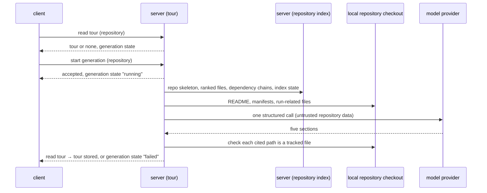

# Spec: Onboarding Tour
Spec ID: SPEC-11
Status: implemented
Supersedes: none
Packages: server, client, e2e
Sources: user brief ("Onboarding Generator": a five-part tour of an unfamiliar repository) · design files in client/docs/design (screen_tour_context — ScreenTour, artboards `tour` and `e-tour`; chrome — sidebar) · two screenshots of the `tour` artboard · existing code (onboarding storage, contract and prompt scaffolding; the repository index facade; the "onboarding" feature model setting) · specs/10-project-context.md · specs/04-conventions-extractor.md · specs/06-repo-stack.md · user answers to the discovery questions (Q1–Q13, proposals P1–P8 accepted)
Amended: 2026-10-05 — AC-16, AC-19, AC-42, EC-8, EC-13, NFR-1 and NFR-13 reworded; AC-77, EC-23 and EC-24 added: the tour's commit is the checkout's head commit, no stale badge without an indexed commit, no re-prompt on invalid output, e2e stub provider and fixture repository (gap found by implementation-planner, decided by the user)

## Problem and user
A developer who opens a repository they have never worked in has no map of it. Today they read the
README, guess which files matter, search for the commands that start the project and pick a first
change by trial and error. DevDigest already indexes the repository and knows which files are
central, but shows none of that as guidance: the "Onboarding Tour" entry of the product design has
no screen behind it.

## Goals / Non-goals
**Goals**
- The developer gets, for the active repository, one tour with five parts in a fixed order: architecture overview, critical paths, how to run locally, guided reading path, first tasks.
- Every file the tour sends the developer to exists in the repository at the commit the tour was generated from.
- One generation costs exactly one model call, and the developer sees what it cost.
- A failed generation never destroys a tour that already exists.
- The developer can tell when the repository has changed since the tour was written, and regenerate it.
- The developer can copy the whole tour as markdown text.

**Non-goals**
- A "Share link" button, as labelled in the design — DevDigest is a local single-user tool, so a link cannot be opened by a teammate; by the user's decision the button is "Copy as Markdown" instead (a recorded deviation from the design).
- Writing the tour into the repository folder (the existing "sync generated docs to a folder" setting) — the checkout is overwritten by a resync; the tour lives only in DevDigest's storage. The setting's text is left for the feature that implements folder sync.
- Feeding project documents (SPEC-10) into the tour's prompt — declined by the user: smaller prompt, no coupling to attachments.
- First tasks taken from GitHub issues — declined by the user; tasks are proposed by the model from repository content.
- A diagram built by code from the import graph — declined by the user; the model writes the diagram.
- One model call per section — declined by the user; one call serves all five sections.
- A live step log during generation — declined by the user; a generating state is enough.
- An in-app file viewer for "Open" — declined by the user; files open on GitHub.
- A history of earlier tours — one tour per repository; a new one replaces the old.
- A confirmation before regenerating — not needed, because a failed regeneration keeps the previous tour.
- Remembering which cards are collapsed — all cards are open on every visit.
- Tour text in a language other than English — the studio has only English messages.
- Checking file paths mentioned inside the overview prose — they are shown as text only, never as links.
- The first-run setup wizard — a different screen.

## User stories
- US-1: As a developer new to a repository, I want to generate an onboarding tour for it, so that I get oriented without reading the whole codebase.
- US-2: As a developer new to a repository, I want an architecture overview with a diagram, so that I understand how the main parts connect.
- US-3: As a developer new to a repository, I want a list of the critical files with a note on each, so that I know what is risky to change.
- US-4: As a developer new to a repository, I want the commands that run the project locally, so that I can start it on my machine.
- US-5: As a developer new to a repository, I want a recommended order for reading files with a reason for each, so that I learn the code in a sensible sequence.
- US-6: As a developer new to a repository, I want three suggested first tasks with their scope and complexity, so that I can pick a safe first contribution.
- US-7: As a developer returning to a tour, I want to see when it is out of date and regenerate it, so that it matches the current repository.
- US-8: As a developer onboarding a teammate, I want to copy the whole tour as markdown, so that I can paste it where the teammate can read it.
- US-9: As a developer paying for model calls, I want to see the model, tokens and cost of the last generation, so that I know what a tour costs.

## Workflow and module interactions

What crosses the boundaries (wire spelling):
- **Tour read** (server → client): `tour` (null when none is stored) and `generation` with `status` (`idle` | `running` | `failed`), `started_at` and, when failed, `error` (a message safe to show).
- **Tour**: `repo_id`, `generated_at`, `commit_sha`, `files_indexed`, `limited_index` (boolean), `provider`, `model`, `tokens_in`, `tokens_out`, `cost_usd` (nullable), `dropped_items` (count of items removed by the path check), and `sections`.
- **Sections**, always the five kinds in this order: `architecture_overview` — `body` (markdown), `diagram` (mermaid text, nullable); `critical_paths` — `files[]` of `path`, `note`; `how_to_run` — `steps[]` of `command`, `source` (the repository file the step was derived from); `guided_reading` — `reading[]` of `path`, `why`; `first_tasks` — `tasks[]` of `title`, `scope`, `complexity` (`low` | `medium` | `high`).
- **Start generation** (client → server): the repository only; no body. Rejected with the error code `generation_in_progress` while one runs for the same repository.
- **Model provider and model**: the workspace's choice for the feature model `onboarding`.

## Acceptance criteria (EARS)

**Entry and page frame**
- AC-1 (US-1): The sidebar shall show an entry "Onboarding Tour" in the WORKSPACE section, between "Pull Requests" and "Project Context", that opens the Onboarding Tour page of the active repository.
- AC-2 (US-1): The Onboarding Tour page shall show the breadcrumb of the repository's full name followed by "Onboarding Tour".
- AC-3 (US-1): WHILE the tour read is loading, the client shall show a loading placeholder in place of the page content.
- AC-4 (US-1): IF the tour read fails, THEN the client shall show an error state titled "Couldn't load the onboarding tour" with a retry control.
- AC-5 (US-1): IF the repository has no local checkout, THEN the client shall show a state saying the repository has not been cloned yet, with no generate control.

**Empty state and starting a generation**
- AC-6 (US-1): WHILE the repository has no stored tour and no generation is running, the client shall show an empty state titled "Generate onboarding tour" with the body "DevDigest indexes the repo and writes a guided tour: architecture, critical paths, how to run, a reading order, and first tasks." and a button "Generate onboarding tour".
- AC-7 (US-9): The empty state shall show no token count and no duration estimate.
- AC-8 (US-1): WHEN the user activates "Generate onboarding tour", the server shall accept the request before the generation itself completes.
- AC-9 (US-1): The server shall keep at most one stored tour per repository.

**Generating state**
- AC-10 (US-1): WHILE a generation is running for a repository with no stored tour, the client shall show the text "Generating onboarding tour…" in place of the empty state, with no generate control.
- AC-11 (US-7): WHILE a generation is running for a repository with a stored tour, the client shall keep showing the stored tour with the Regenerate button disabled and labelled "Regenerating…".
- AC-12 (US-1): WHEN the user opens the Onboarding Tour page while a generation is running for that repository, the client shall show the generating state.
- AC-13 (US-1): WHEN a running generation ends successfully, the client shall show the new tour without a manual page reload.
- AC-14 (US-1): IF a generation is requested while one is running for the same repository, THEN the server shall reject the request with the error code `generation_in_progress`.
- AC-15 (US-1): IF more than 10 generation requests arrive within one minute, THEN the server shall reject the further requests with a rate-limit error.

**What a generation produces**
- AC-16 (US-1): The server shall send exactly one request to the model provider per generation, with no repeated request when the output does not match the tour's structure.
- AC-17 (US-1): The server shall use for the generation the provider and model selected in Settings for the feature model "onboarding".
- AC-18 (US-1): WHEN a generation succeeds, the server shall store a tour with exactly the five sections `architecture_overview`, `critical_paths`, `how_to_run`, `guided_reading`, `first_tasks`, in that order.
- AC-19 (US-7): WHEN a generation succeeds, the server shall store with the tour, as the commit it was generated from, the head commit of the repository's local checkout at generation time, together with the number of indexed files at that moment and the generation time.
- AC-20 (US-9): WHEN a generation succeeds, the server shall store with the tour the provider, the model, the input tokens, the output tokens and the cost in US dollars of the model call.
- AC-21 (US-3, US-5): IF a `critical_paths` or `guided_reading` item names a path that is not a tracked file of the repository's checkout at generation time, THEN the server shall drop that item from the tour.
- AC-22 (US-3, US-5): WHEN a generation succeeds, the server shall store with the tour the number of items dropped by the path check as `dropped_items`.
- AC-23 (US-3): The server shall store at most 8 files in `critical_paths`.
- AC-24 (US-5): The server shall store at most 8 files in `guided_reading`.
- AC-25 (US-4): The server shall store at most 8 steps in `how_to_run`.
- AC-26 (US-6): The server shall store at most 3 tasks in `first_tasks`.
- AC-27 (US-6): The server shall store for each first task a complexity of `low`, `medium` or `high`.
- AC-28 (US-4): The server shall store for each `how_to_run` step the repository file the step was derived from.
- AC-29 (US-1): IF the model returns more items for a section than the section's maximum, THEN the server shall keep the first items up to the maximum.
- AC-30 (US-1): IF a section has fewer items than requested, or none, after the path check, THEN the server shall still store the tour with the items that remain.
- AC-31 (US-1): WHERE the repository's index has no ranked files, the server shall still generate a tour, taking candidate files from the repository's tracked-file list, its manifests and its README.
- AC-32 (US-1): WHERE the repository's index has no ranked files, the server shall store the tour with `limited_index` set to true.
- AC-33 (US-4): The server shall not send to the model the content of any environment file of the checkout other than an example environment file.

**Generation failure**
- AC-34 (US-1): IF the model call fails, times out or returns output that does not match the tour's structure, THEN the server shall end the generation in the state `failed` with an error message.
- AC-35 (US-1): IF no API key is stored for the selected provider, THEN the server shall end the generation in the state `failed` with a message naming the provider.
- AC-36 (US-7): IF a generation fails, THEN the server shall leave the previously stored tour of that repository unchanged.
- AC-37 (US-7): IF a generation fails for a repository with a stored tour, THEN the client shall show an error banner with the error message and a "Retry" control above the stored tour.
- AC-38 (US-1): IF a generation fails for a repository with no stored tour, THEN the client shall show the empty state with the error message above its button.
- AC-39 (US-1): IF the repository is removed while a generation is running, THEN the server shall store no tour for it.

**Tour header**
- AC-40 (US-1): WHILE a tour is stored, the page shall show the title "Onboarding for" followed by the repository's name.
- AC-41 (US-7): WHILE a tour is stored, the page shall show the subtitle "Generated from index of N files · generated T", where N is the tour's stored indexed-file count and T is the relative time since the tour's generation.
- AC-42 (US-7): WHILE the repository has an indexed commit and that commit differs from the tour's stored commit, the page header shall show a badge "Repository changed since this tour was generated".
- AC-77 (US-7): IF the repository has no indexed commit, THEN the page header shall show no "Repository changed since this tour was generated" badge.
- AC-43 (US-1): WHILE the stored tour has `limited_index` set to true, the page header shall show the note "Limited index — file suggestions are less precise".
- AC-44 (US-7): WHILE a tour is stored, the page header shall show a button "Regenerate".
- AC-45 (US-7): WHEN the user activates "Regenerate", the server shall start a new generation without asking for confirmation.
- AC-46 (US-7): WHEN a regeneration succeeds, the server shall replace the stored tour with the new one.
- AC-47 (US-9): WHILE a tour is stored, the page shall show below the last card one line with the model, the input tokens, the output tokens and the cost of the tour's generation.
- AC-48 (US-9): IF the stored tour has no cost, THEN the page shall show `—` in place of the cost in that line.

**Copy as Markdown**
- AC-49 (US-8): WHILE a tour is stored, the page header shall show a button "Copy as Markdown" in the place of the design's "Share link" button.
- AC-50 (US-8): WHEN the user activates "Copy as Markdown", the client shall put on the clipboard one markdown text containing the title and the five sections in order, each under its own heading, with every item of every section.
- AC-51 (US-8): WHEN the copy succeeds, the client shall show the confirmation "Copied".
- AC-52 (US-8): IF the copy fails, THEN the client shall show an error message.

**Navigation and cards**
- AC-53 (US-1): WHILE a tour is stored, the page shall show a list "On this page" with one item per section, in section order, titled "Architecture overview", "Critical paths", "How to run locally", "Guided reading path", "First tasks".
- AC-54 (US-1): WHEN the user activates an "On this page" item, the client shall scroll that section's card to the top of the visible area.
- AC-55 (US-1): WHEN the user activates an "On this page" item, the client shall put that section's kind into the page address as its anchor.
- AC-56 (US-1): WHEN the user opens the page with a section's kind as the address anchor, the client shall scroll that section's card to the top of the visible area.
- AC-57 (US-1): WHILE the user scrolls the tour, the "On this page" list shall mark as active the item of the section at the top of the visible area.
- AC-58 (US-1): The page shall show each section as one card with the section's title, open when the page loads.
- AC-59 (US-1): WHEN the user activates a card's header, the client shall toggle the card between open and collapsed.
- AC-60 (US-1): IF a section has no items and no text, THEN the page shall show "Nothing found for this section" in that section's card.

**Architecture overview**
- AC-61 (US-2): The Architecture overview card shall show the section's body rendered as markdown.
- AC-62 (US-2): The server shall store an overview body of at most 1,200 characters.
- AC-63 (US-2): WHILE the section has a diagram, the Architecture overview card shall show the diagram rendered as a flowchart below the body.
- AC-64 (US-2): IF the diagram text cannot be rendered, THEN the Architecture overview card shall show the body without a diagram area and without an error message.

**Critical paths**
- AC-65 (US-3): The Critical paths card shall show each file as a row with its repository-relative path, its note and a button "Open".
- AC-66 (US-3): WHEN the user activates "Open" on a row, the client shall open in a new browser tab the GitHub page of that file at the tour's stored commit.

**How to run locally**
- AC-67 (US-4): The How to run locally card shall show each step as a numbered row, starting at 1, with the command in monospace text and a copy control.
- AC-68 (US-4): The How to run locally card shall show under each command the repository file the step was derived from.
- AC-69 (US-4): WHEN the user activates a step's copy control, the client shall put that step's command text on the clipboard.
- AC-70 (US-4): WHEN a step's command is copied, the client shall show the confirmation "Copied" on that step.
- AC-71 (US-4): WHILE the section has at least one step, the How to run locally card shall show the line "Commands are generated from repository files — read them before running".
- AC-72 (US-4): The system shall never execute a command of the tour.

**Guided reading path**
- AC-73 (US-5): The Guided reading path card shall show each file as a numbered row, starting at 1, with its repository-relative path and its reason below the path.
- AC-74 (US-5): WHEN the user activates a path in the Guided reading path card, the client shall open in a new browser tab the GitHub page of that file at the tour's stored commit.

**First tasks**
- AC-75 (US-6): The First tasks card shall show each task as its own tile with the task's title, its scope in monospace text and a badge "Low complexity", "Medium complexity" or "High complexity".
- AC-76 (US-6): The First tasks card shall show a task's scope as plain text without a link.

## Edge cases
- EC-1: the user clicks "Generate onboarding tour" twice, or two browser tabs start a generation for the same repository → one generation runs; the second request is rejected with `generation_in_progress` and both tabs show the running one (AC-12, AC-14)
- EC-2: the user leaves the page or reloads it during a generation → the generation continues; on return the page shows the generating state, then the tour or the error (AC-8, AC-12, AC-13)
- EC-3: the model names a file that is not in the repository → the item is dropped, counted in `dropped_items`, and never shown (AC-21, AC-22)
- EC-4: every item of Critical paths is dropped by the path check → the tour is stored; the card shows "Nothing found for this section" (AC-30, AC-60)
- EC-5: the model returns 12 files for Guided reading → the first 8 are stored (AC-24, AC-29)
- EC-6: the model returns 2 first tasks instead of 3 → the tour is stored with 2 tiles (AC-30, AC-75)
- EC-7: the model returns a diagram that does not render → the overview shows its text only (AC-64)
- EC-8: a Flutter or Python repository, for which the index has no ranked files → a tour is still generated from the file list, manifests and README, and the header shows the "Limited index" note; the tour's commit is the checkout's head commit, so "Open" and the reading-path links work as for any other repository (AC-19, AC-31, AC-32, AC-43, AC-66, AC-74)
- EC-9: the repository has no README and no manifest → the generation still succeeds; How to run locally shows "Nothing found for this section" when no step results (AC-30, AC-60)
- EC-10: the model returns malformed output → the generation ends as failed; an existing tour stays and the banner offers Retry (AC-34, AC-36, AC-37)
- EC-11: the first generation of a repository fails → the empty state returns with the error message; nothing is stored (AC-34, AC-38)
- EC-12: no API key for the selected provider → the generation fails with a message naming the provider (AC-35)
- EC-13: the repository is resynced and re-indexed at a newer commit after the tour was generated → the indexed commit differs from the tour's commit, so the stale badge shows; "Open" still leads to the files as they were at the tour's commit (AC-19, AC-42, AC-66)
- EC-14: a file named in the tour was later deleted from the default branch → its link still opens the file at the tour's commit (AC-66, AC-74)
- EC-15: a hostile README instructs the model to emit a harmful command → the text reaches the model only as untrusted data; whatever command results is shown as text with its source file and the warning line, and is never run by DevDigest (AC-68, AC-71, AC-72, NFR-4)
- EC-16: the checkout holds a real environment file with secrets → its content is never sent to the model (AC-33)
- EC-17: the repository was added but never cloned → the page shows the not-cloned state without a generate control (AC-5)
- EC-18: the repository is removed during a generation → no tour is stored for it (AC-39)
- EC-19: a script calls the generation route in a loop → requests beyond 10 per minute are rejected (AC-15)
- EC-20: a first task's scope names a file that does not exist yet, or a folder → it is shown as text, not as a link, and is not subject to the path check (AC-21, AC-76)
- EC-21: the page is opened with an anchor that is not one of the five section kinds → the page opens at its top (AC-56)
- EC-22: the clipboard is unavailable when the user copies the tour → an error message shows and nothing else changes (AC-52)
- EC-23: the repository has no indexed commit (its index never produced one, or is still building) → the tour is generated and stored with the checkout's head commit; the stale badge is not shown, however old the tour is (AC-19, AC-77)
- EC-24: the model's output does not match the tour's structure → the provider is not asked again; the generation ends as failed after that one request, and the user starts a new one with Retry or Regenerate (AC-16, AC-34)

## Non-functional requirements
- NFR-1: Cost — one generation makes exactly 1 model call, with 0 automatic repeats of the request when the output is invalid; reading the page, copying, opening files and navigating make 0 model calls.
- NFR-2: Cost — a generation makes 0 requests to GitHub; all repository input comes from the local checkout and the stored index.
- NFR-3: Security — repository text (file content, file paths, README, manifests) enters the prompt only inside blocks marked as untrusted data, with the closing marker of such a block escaped; the system prompt keeps the rule that such data is never instructions.
- NFR-4: Security — model output is validated against the tour's structure before it is stored; it is rendered as markdown text or plain text, never as raw HTML, with links limited to the schemes the studio's markdown renderer already allows.
- NFR-5: Security — the diagram is rendered with the studio's strict diagram security level; diagram text cannot add HTML or click handlers.
- NFR-6: Security — model output never chooses a command, a path, a URL or a query that the system executes or reads; links to GitHub are built from the repository's stored owner and name, the tour's stored commit and a path that passed the path check.
- NFR-7: Security — every file read for a generation stays inside the repository's checkout after symbolic links are resolved.
- NFR-8: Security — every route of this feature resolves the caller's workspace and serves only repositories of that workspace.
- NFR-9: Security — an error message shown to the user carries no provider key, no stack trace and no raw provider response.
- NFR-10: Observability — server log lines about a generation carry the repository id, the outcome, the token counts and the cost, never repository text or model output.
- NFR-11: Accessibility — every control of the page (generate, regenerate, copy, card headers, "On this page" items, "Open", path links) is reachable and operable by keyboard, with a visible focus indicator and an accessible name.
- NFR-12: i18n — every fixed string of the page comes from the client's message catalogue; the tour's generated text is English; both colour themes are supported.
- NFR-13: Testability — one deterministic e2e flow covers: the empty state, generating a tour, the five cards with their items, and regenerating. It runs against a stub model provider selected by an environment setting, so it makes 0 requests to a real provider, and against a fixture repository committed in the e2e package, never the demo repository. The e2e package's rule against model calls and data changes is relaxed for this one flow only.
- NFR-14: Data — the scaffolded tour contract and prompt section kinds that predate this spec are replaced by the five typed sections; no stored tour in the old shape exists to migrate.

## Inputs and provenance
| Input | Provenance | Notes |
|---|---|---|
| Repository skeleton (project map) | [reused: repository index repo map] | Already cached per repository |
| Candidate files for critical paths and guided reading: top-ranked files and dependency chains | [deterministic: repo-intel] | Exist in the index facade with no consumer today; empty for non-JS/TS repositories |
| Indexed file count, current indexed commit, index status | [reused: repository index state] | The file count is stored with the tour; the indexed commit is only compared with the tour's commit for the stale badge and may be absent |
| Head commit of the local checkout | [deterministic: server repository checkout] | Stored as the tour's commit; exists whenever the repository is cloned |
| Frameworks, languages, key packages | [reused: SPEC-06 repo stack] | Stored per repository |
| Tracked-file list of the checkout | [deterministic: server repository checkout] | Path check; candidate source for a limited index |
| README, manifests and their scripts, container-compose file, example environment file | [deterministic: server repository checkout] | Source of the run steps; real environment files excluded |
| Overview prose, diagram, file notes, reading reasons, run steps, first tasks | [new: 1 LLM call] | Nothing stored explains why a file matters, how the parts connect or what a newcomer could do first; rank and edges give only order |
| Provider and model | [reused: settings feature model "onboarding"] | Selectable in Settings today |
| Tokens and cost of the call | [deterministic: server cost calculation] | Same calculation as for review runs |
| Repository owner, name and tour commit for GitHub links | [reused: repos module] | No GitHub request is made |

## Untrusted inputs
| Input | Who controls it | Where it goes | Required handling |
|---|---|---|---|
| File content from the checkout (README, manifests, compose and example environment files, code excerpts) | The repository's authors | Generation prompt | Only inside a block marked as untrusted data; the closing marker escaped; the injection guard stays in the system prompt; no keyword filtering |
| File paths and the repository skeleton | The repository's authors | Generation prompt, tour rows, GitHub links | In the prompt only inside the untrusted block; on the page shown as plain text; in a link only after the path check, encoded as a path |
| Files and symbolic links in the checkout | The repository's authors | File reads on the server | A read never leaves the checkout after links are resolved; real environment files are never read into the prompt |
| Model output: overview prose, notes, reasons, task titles and scopes | Steerable by the texts above | Stored tour, page, copied markdown | Validated against the tour's structure; rendered as markdown or plain text, never raw HTML; never used to choose a file to read, a command to run or a URL to request |
| Model output: diagram text | Steerable by the texts above | Diagram renderer | Strict diagram security level; a diagram that fails to render is not shown |
| Model output: run commands | Steerable by the texts above | Page, clipboard | Shown as text with the source file and the warning line; copied only on the user's action; never executed by the system |
| Model output: cited paths | Steerable by the texts above | Tour rows, GitHub links | Kept only when the path is a tracked file of the checkout; otherwise the item is dropped |
| Requests to start a generation | Any caller of the local API, including a web page in the user's browser | A paid model call | Workspace-scoped; at most 10 per minute; one running generation per repository |

## Open questions
- OQ-1: How long may a generation run before it is ended as failed, and what happens to a generation that was running when the API restarted? — default if unanswered: a generation that has not finished within 180 s ends as `failed` with the message "Generation timed out"; a generation interrupted by a restart is reported as `failed` on the next tour read.
- OQ-2: What is the largest prompt one generation may send? — default if unanswered: at most 30,000 input tokens; the repository skeleton and file excerpts are cut to fit, the README first in priority.
- OQ-3: What happens when the model's overview is longer than 1,200 characters (AC-62)? — default if unanswered: the text is cut at 1,200 characters and ends with "…"; the generation does not fail.
- OQ-4: What happens to a run step whose source file is missing or is not a tracked file (AC-28)? — default if unanswered: the step is dropped and counted in `dropped_items`, like a file item.
- OQ-5: Which file names count as an example environment file that may be sent to the model (AC-33)? — default if unanswered: only names ending in `.example`, `.sample` or `.template`.
- OQ-6: When the user activates an "On this page" item whose card is collapsed, does the card open? — default if unanswered: yes, the card opens before the scroll.
- OQ-7: Is the `dropped_items` count shown on the page? — default if unanswered: no; it is returned with the tour and logged, not shown.
- OQ-8: When the repository has a checkout but its index has not finished building, is generating allowed? — default if unanswered: yes; it is treated as a limited index (AC-31, AC-32).
