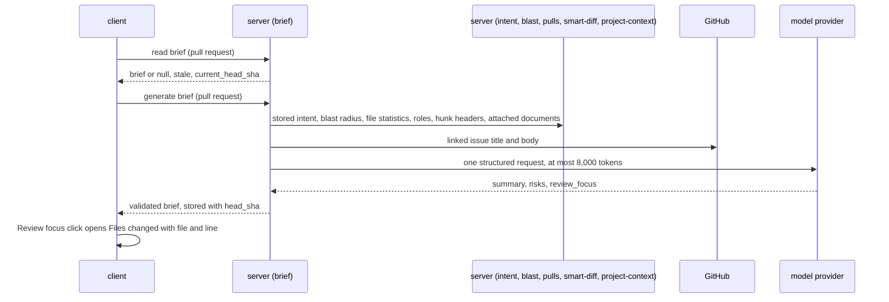

# Spec: PR Brief
Spec ID: SPEC-12
Status: implemented
Supersedes: none
Packages: server, client
Sources: user brief (course homework L05 "PR Why + Risk Brief", with its P1/P2/P3 criteria) · five screenshots of the reference build (Overview with the brief, Files changed after a Review focus click) · design files in client/docs/design (screen_pr_detail, findings, diff, blast, data, artboards) · specs/08-intent-layer.md · specs/09-smart-diff.md · specs/10-project-context.md · docs/blast-radius.md · user answers to the discovery questions (Q1–Q13 option 1 each, proposals P1–P9 accepted)

## Problem and user
A developer who reviews someone else's pull request in DevDigest opens it cold: they do not know
why the change exists, what is risky in it, or which file to read first. The studio already
answers parts of this in separate places: the Intent card states the purpose, Smart Diff orders
files by role, the Blast radius card shows what else the change reaches. Nothing joins them into
one answer, nothing names the concrete risks of this pull request with the file each one concerns,
and nothing says which lines to start reading from. The developer assembles that picture by hand
on every pull request.

## Goals / Non-goals
**Goals**
- The Overview tab has one PR Brief block that, on demand, shows a summary of what the pull request does and why, its Risk areas with a file each, and a Review focus reading list of `file:line — reason`.
- Every file named in Risk areas and Review focus exists in the pull request or in its blast radius map; every Review focus line lies inside a changed range of its file.
- A click on a Review focus item lands on the Files changed tab at that file and line.
- A brief is stored per pull request with the head SHA it was generated for, is shown again after a reload with no model call, and is replaced only when the user asks.
- One generation is one structured model call whose whole request stays within 8,000 tokens and carries no diff hunk body.
- The brief says which inputs it was generated without, which commit it belongs to, and which model, token counts and cost produced it.

**Non-goals**
- "Prior PRs touching these files" — a P3 item of lesson L04 that the course excludes from the brief; no pull-request history is computed in this product.
- An MCP tool for the brief — not requested.
- Automatic generation (on opening a pull request, after a new commit, after a review) — the user chose generation on demand only, so that no model call is spent without a click.
- Deriving or re-deriving the intent as part of a brief — it would be a second model call; a missing or stale intent is reported instead.
- Storing a snapshot of the intent and of the blast radius inside the brief — the user chose one source of truth per block; the Intent and Blast radius cards keep reading their own data.
- A separate list of documents attached to the brief — the brief reuses the documents already attached to agents and skills; a list of its own is a feature with new screens.
- Marking a brief stale when an input changes while the head SHA stays the same (intent re-derived, index rebuilt, documents re-attached, description edited) — the user chose the head SHA as the only stale signal.
- The cost badge inside the top banner as drawn in the design — replaced by the brief's own provenance footer.
- New automated tests and an e2e flow — switched off by the user for this run.
- The demo video — out of scope of the spec by the user's decision.

## User stories
- US-1: As a developer reviewing a pull request, I want a PR Brief block with a Generate brief button on the Overview tab, so that I can ask for a brief when I need one.
- US-2: As a developer reviewing a pull request, I want a short summary of what the pull request does and why next to its Intent and Blast radius, so that I understand the change before reading code.
- US-3: As a developer reviewing a pull request, I want each risk listed with a title and the file it concerns, so that I know where the change can hurt.
- US-4: As a developer reviewing a pull request, I want an ordered list of lines to read first that opens the diff at the chosen line, so that I start the review from the places that matter.
- US-5: As a developer returning to a pull request, I want the stored brief shown at once, so that I neither wait nor pay for it again.
- US-6: As a developer reviewing a pull request, I want to regenerate the brief, so that it reflects the current state of the pull request.
- US-7: As a developer reading a brief, I want to see which inputs were missing, which commit it was generated for and which model produced it, so that I know how far to trust it.
- US-8: As a developer paying for model calls, I want each brief to cost one bounded model call, so that generating briefs stays cheap and predictable.

## Workflow and module interactions

What crosses the boundaries (wire spelling):
- **Brief read response** (server → client): `brief` (the stored brief or null), `stale`, `current_head_sha`.
- **Brief** (server → client, also the stored value): `summary`; `risks[]` each with `kind`, `title`, `explanation`, `severity` (`high` | `medium` | `low`), `file_refs[]` (repository-relative paths, no line numbers); `review_focus[]` each with `file`, `line`, `reason`; `head_sha`; `generated_at`; `provider`; `model`; `tokens_in`; `tokens_out`; `cost_usd`; `missing[]`.
- **`missing` values**: `intent`, `intent_stale`, `blast`, `issue`, `specs`, `description`, `specs_trimmed`, `issue_trimmed`, `description_trimmed`, `callers_trimmed`, `hunks_trimmed`, `files_trimmed`.
- **Composed brief contract**: the existing `PrBrief` shape gains the fields above; its `intent`, `blast` and `history` members are no longer required.
- **Model answer** (model provider → server): `summary`, `risks[]`, `review_focus[]` only.
- **Jump target** (Overview tab → Files changed tab): query-string values `tab=diff`, `file` (repository-relative path) and `line` (new-side line number, absent for a jump to a file).

## Acceptance criteria (EARS)

**Block and empty state**
- AC-1 (US-1): The Overview tab shall show a block labelled "PR Brief" above the Intent and Blast radius cards.
- AC-2 (US-1): WHILE the pull request has no stored brief, the PR Brief block shall show an empty state with the title "No brief yet", the text "Generate a Why+Risk brief for this PR." and a button "Generate brief".
- AC-3 (US-2): The Overview tab shall show the Intent card and the Blast radius card side by side whether or not a brief exists.
- AC-4 (US-3): The Intent card shall label its risk chips "Risk signals".

**Generation**
- AC-5 (US-2): WHEN the user activates "Generate brief", the server shall generate a brief for the pull request's current head SHA.
- AC-6 (US-2): WHILE a generation is in flight, the PR Brief block shall show a skeleton in place of the summary, the Risk areas list and the Review focus block.
- AC-7 (US-8): WHILE a generation is in flight, the client shall keep the "Generate brief" button and the refresh control disabled.
- AC-8 (US-8): IF a generate request arrives while a generation for the same pull request is in flight, THEN the server shall answer it without starting a second model call.
- AC-9 (US-2, US-5): WHEN a generation succeeds, the server shall store the brief as the pull request's only stored brief, replacing any earlier one.
- AC-10 (US-2): WHEN a generation succeeds, the client shall show the new brief without a page reload.
- AC-11 (US-6): The server shall accept a generate request for a pull request in any status, closed and merged included.
- AC-12 (US-5, US-8): The server shall start a generation only in response to a generate request.

**Model inputs**
- AC-13 (US-2, US-8): The server shall build the model request only from these facts: the pull request's title and description, the stored intent, the blast radius, per-file statistics with role groups, hunk headers, the linked issue and the attached project documents.
- AC-14 (US-8): The model request shall contain no added, removed or context line of any diff hunk body.
- AC-15 (US-4): The model request shall list for each changed file its path, additions, deletions and Smart Diff role group.
- AC-16 (US-4): The model request shall carry at most 5 hunk headers per changed file, each cut to 120 characters.
- AC-17 (US-2): WHILE the pull request has a stored intent, the model request shall include the intent's summary, in-scope items, out-of-scope items and risk-signal labels.
- AC-18 (US-7): IF the pull request has no stored intent, THEN the server shall add `intent` to the brief's `missing` list.
- AC-19 (US-8): The server shall not derive or re-derive the intent while generating a brief.
- AC-20 (US-7): IF the stored intent's head SHA differs from the pull request's current head SHA, THEN the server shall add `intent_stale` to the brief's `missing` list.
- AC-21 (US-2): WHILE the pull request's blast radius reports at least one changed symbol, the model request shall include the blast summary, the changed symbols, the listed callers with file and line, the affected endpoints and the affected cron jobs.
- AC-22 (US-7): IF the pull request's blast radius reports no changed symbol, THEN the server shall add `blast` to the brief's `missing` list.
- AC-23 (US-2): The model request shall carry the pull request's description cut to 6,000 characters.
- AC-24 (US-7): IF the pull request's description is empty, THEN the server shall add `description` to the brief's `missing` list.
- AC-25 (US-2): The server shall take as the linked issue the pull request's first closing issue or, when it has none, the first same-repository `#N` reference found in the title, the description or the branch name.
- AC-26 (US-2): WHEN the linked issue is read from GitHub, the model request shall include its title and body cut to 3,000 characters in total.
- AC-27 (US-7): IF no linked issue is found or it cannot be read, THEN the server shall add `issue` to the brief's `missing` list.
- AC-28 (US-2): The server shall take as candidate documents the project documents that at least one agent receives for the pull request's repository, directly or through an enabled skill, ordered by the number of receiving agents, highest first, then by path ascending.
- AC-29 (US-2, US-8): The model request shall include each candidate document whole, in candidate order, leaving out every document that would take the included documents' total above 3,000 tokens.
- AC-30 (US-2): The server shall read candidate documents from the repository's local default-branch checkout, skipping a document that is missing, larger than 65,536 bytes or unreadable.
- AC-31 (US-7): IF no document is included in the model request, THEN the server shall add `specs` to the brief's `missing` list.
- AC-32 (US-7): IF a candidate document is left out because of the 3,000-token share, THEN the server shall add `specs_trimmed` to the brief's `missing` list.
- AC-33 (US-6): IF the pull request has no stored files, THEN the server shall generate the brief from the remaining inputs.

**Input budget**
- AC-34 (US-8): The server shall count the tokens of the whole model request, system text plus every input, with the server's token counter before the model call.
- AC-35 (US-8): IF that count exceeds 8,000 tokens, THEN the server shall remove inputs in this fixed order until the count is at most 8,000: attached documents from the last to the first, the linked issue, the description, the blast callers, the hunk headers, the file statistics of every file outside the 50 files with the most changed lines.
- AC-36 (US-8): IF the count still exceeds 8,000 tokens after those six steps, THEN the server shall remove file statistics one file at a time, fewest changed lines first, until the count is at most 8,000.
- AC-37 (US-7): WHEN an input is removed to fit the budget, the server shall add the matching value of `specs_trimmed`, `issue_trimmed`, `description_trimmed`, `callers_trimmed`, `hunks_trimmed` or `files_trimmed` to the brief's `missing` list.
- AC-38 (US-8): The server shall not fail a generation because of the size of its inputs.

**Model call**
- AC-39 (US-8): The server shall make one structured model call per generation.
- AC-40 (US-8): The server shall use for that call the provider and model of the workspace's `risk_brief` setting.
- AC-41 (US-8): WHERE the workspace has not chosen a `risk_brief` model, the server shall use the provider `openrouter` with the model `deepseek/deepseek-v4-flash`.
- AC-42 (US-2): The server shall accept a model answer only when it matches the contract `summary`, `risks[]` (`kind`, `title`, `explanation`, `severity`, `file_refs[]`) and `review_focus[]` (`file`, `line`, `reason`).
- AC-43 (US-3): The server shall accept as a risk `kind` only one of `auth`, `dependency`, `migration`, `ci_config`, `secrets_config`, `performance`, `api_contract`, `data` and `other`.

**Answer validation**
- AC-44 (US-3): The server shall remove from each risk every `file_refs` entry that equals neither the path of a file of the pull request nor, when the blast radius reports at least one changed symbol, the path of a changed-symbol file or of a listed caller.
- AC-45 (US-3): IF a risk has no `file_refs` entry left, THEN the server shall drop that risk from the brief.
- AC-46 (US-4): IF a review-focus item's `file` is not the path of a file of the pull request, THEN the server shall drop that item from the brief.
- AC-47 (US-4): IF a review-focus item's `line` lies outside every changed new-side line range of its file, THEN the server shall drop that item from the brief.
- AC-48 (US-3): The server shall keep at most the first 5 risks of a model answer.
- AC-49 (US-4): The server shall keep at most the first 7 review-focus items of a model answer.
- AC-50 (US-3): The server shall keep at most the first 3 `file_refs` entries of each risk.
- AC-51 (US-2, US-3, US-4): The server shall cut the stored texts to these lengths: `summary` 400 characters, risk `title` 80, risk `explanation` 400, review-focus `reason` 160.
- AC-52 (US-7): The server shall store with each brief its `head_sha`, `generated_at`, `provider`, `model`, `tokens_in`, `tokens_out`, `cost_usd` and `missing` list.

**Reading, reload and stale**
- AC-53 (US-5): WHEN the user opens the Overview tab of a pull request that has a stored brief, the client shall show the stored brief with no model call made.
- AC-54 (US-5, US-7): The server shall answer a brief read request with the stored brief or null, a `stale` flag and the pull request's `current_head_sha`.
- AC-55 (US-7): The server shall report `stale` as true exactly when the stored brief's `head_sha` differs from the pull request's current head SHA.
- AC-56 (US-7): WHILE the brief is stale, the PR Brief block shall show the stored brief with the note "Generated for <sha>, the PR has new commits", where <sha> is the first 7 characters of the brief's `head_sha`.
- AC-57 (US-6): WHEN the user activates the refresh control, the server shall generate a new brief for the pull request's current head SHA.
- AC-58 (US-5): IF the stored value does not match the brief contract, THEN the server shall answer the read request with a null brief.

**Banner, notice and footer**
- AC-59 (US-2): WHILE a brief is shown, the PR Brief block shall show at its top a banner holding the brief's `summary` as plain text.
- AC-60 (US-6): The banner shall hold a refresh control whose accessible name is "Re-run the brief for this PR".
- AC-61 (US-2): WHILE the pull request has at least one review, the banner shall show the verdict, the finding count, the blocker count and the PR score of the latest review round.
- AC-62 (US-2): WHILE the latest review round holds several reviews, the banner shall show the most severe of their verdicts in the order request changes, comment, approve.
- AC-63 (US-2): The banner shall show as PR score the same score the pull-request list shows for that pull request.
- AC-64 (US-2): IF the pull request has no review, THEN the banner shall show no verdict, no finding count and no PR score.
- AC-65 (US-7): WHILE the banner shows a verdict, the banner shall offer a hint with the text "Verdict, findings and score come from the latest agent review; what / why / risks / review-focus come from the brief."
- AC-66 (US-7): WHILE the brief's `missing` list is not empty, the PR Brief block shall show one notice that names every entry of the list in words.
- AC-67 (US-7): WHILE a brief is shown, the PR Brief block shall show a footer with the first 7 characters of `head_sha`, the provider and model, the input and output token counts and the cost in US dollars.

**Risk areas**
- AC-68 (US-3): WHILE a brief is shown, the Overview tab shall show below the Intent and Blast radius cards a list labelled "Risk areas" holding each risk with its title and its first file reference.
- AC-69 (US-3): The Risk areas list shall show each risk's icon in the colour of its severity: the critical colour for `high`, the warning colour for `medium`, the info colour for `low`.
- AC-70 (US-3): WHEN the user expands a risk, the client shall show the risk's explanation and all of its file references.
- AC-71 (US-3): IF the brief has no risks, THEN the Risk areas list shall show the text "No notable risks flagged."
- AC-72 (US-3, US-4): WHEN the user activates a risk's file reference that is a file of the pull request, the client shall open the Files changed tab at that file.
- AC-73 (US-3): IF the user activates a risk's file reference that is not a file of the pull request, THEN the client shall stay on the Overview tab, showing the transient message "File not in this PR's diff".

**Review focus**
- AC-74 (US-4): WHILE the brief has at least one review-focus item, the Overview tab shall show a block titled "Review focus — read these first" with the item count, listing the items in stored order as `file:line — reason`.
- AC-75 (US-4): IF the brief has no review-focus item, THEN the Overview tab shall show no Review focus block.
- AC-76 (US-4): WHEN the user activates a review-focus item, the client shall open the Files changed tab with the item's file and line in the URL query string as `tab=diff`, `file` and `line`.

**Arrival on Files changed**
- AC-77 (US-4): WHEN the Files changed tab opens with a `file` value that names a file of the pull request, the client shall show that file's diff expanded, with its role group open.
- AC-78 (US-4): WHEN the Files changed tab opens with a `file` and a `line` that is among the file's shown lines, the client shall scroll that line into view.
- AC-79 (US-4): IF the `line` value is absent or is not among the file's shown lines, THEN the client shall scroll the file's header into view.
- AC-80 (US-4): WHEN the Files changed tab opens with a `file` value that names a file of the pull request, the client shall mark that file's card with the accent border.
- AC-81 (US-4): WHEN the client scrolls a target line into view, the client shall highlight that line for about 2 seconds.
- AC-82 (US-4): WHEN the user goes back in the browser history after a jump from the brief, the client shall show the Overview tab.

**Failures**
- AC-83 (US-2): IF a generation fails while the pull request has no stored brief, THEN the PR Brief block shall show an error state with a Retry control.
- AC-84 (US-6): IF a generation fails while the pull request has a stored brief, THEN the PR Brief block shall keep showing the stored brief.
- AC-85 (US-6): IF a generation fails while the pull request has a stored brief, THEN the client shall show an error message.
- AC-86 (US-2): IF a generation fails because the chosen provider has no configured key, THEN the error shown shall name the provider with a link to Settings.
- AC-87 (US-2): IF the model answer does not match the contract after the permitted re-ask, THEN the server shall end the generation as failed.
- AC-88 (US-5, US-6): IF a generation fails, THEN the server shall leave the stored brief unchanged.

**Course criteria coverage** (homework L05 priorities → criteria of this spec)

| Course criterion | Priority | Covered by |
|---|---|---|
| Overview has a PR Brief block; Generate brief button while there is no brief | P1 | AC-1, AC-2 |
| After generation: summary, Risk areas, Review focus; Intent and Blast radius beside them; missing data stated plainly | P1 | AC-3, AC-5, AC-10, AC-59, AC-68, AC-74, AC-18, AC-22, AC-66 |
| Every risk has a title and a file; every Review focus item has `file:line` and a reason | P1 | AC-42, AC-45, AC-68, AC-74 |
| Every file is in the pull request or in the blast radius map; no invented paths | P1 | AC-44, AC-45, AC-46, AC-47 |
| A Review focus click opens Files changed at that file | P1 | AC-76, AC-77 |
| After a reload the brief appears at once with no generation; the refresh button regenerates | P1 | AC-9, AC-53, AC-57 |
| Exactly one model call, visible in the trace or the logs | P2 | AC-39, AC-8, NFR-1, NFR-10 |
| Input within the budget; diff hunk bodies never reach the model | P2 | AC-14, AC-34, AC-35, AC-36, AC-38, NFR-2 |
| Answer validated by the contract; `summary` and `review_focus` in both contract copies | P2 | AC-42, AC-43, AC-87, NFR-12 |
| Model from the `risk_brief` setting, not hard-coded | P2 | AC-40, AC-41 |
| Cache bound to the SHA; stale or regenerated after a new commit | P2 | AC-52, AC-55, AC-56 |
| A Review focus click scrolls the diff to the exact line | P2 | AC-78, AC-79, AC-81 |
| Top banner with verdict and PR score of the latest review | P3 | AC-59, AC-61, AC-62, AC-63, AC-64, AC-65 |
| A risk expands to its explanation | P3 | AC-70 |
| A click on a risk leads to the file on Files changed | P3 | AC-72 |
| "File not in this PR's diff" message | P3 | AC-73 |
| Skeleton while generating | P3 | AC-6 |
| Block labels from the message catalogue | P3 | NFR-9 |

## Edge cases
- EC-1: the pull request has no stored intent → the brief is generated without it, no intent is derived, the notice names the intent as missing (AC-18, AC-19, AC-66)
- EC-2: the stored intent belongs to an older head SHA → it is used as input and the notice says the intent is from an older commit (AC-17, AC-20, AC-66)
- EC-3: the blast radius is degraded or reports no changed symbol → the brief is generated without it, the notice names it, and risk files are checked against the pull request's files only (AC-22, AC-44, AC-66)
- EC-4: the model names a file that is neither in the pull request nor in the blast map → the reference is removed; a risk left with no file is dropped (AC-44, AC-45)
- EC-5: the model puts a file of the blast map that is not in the diff into Review focus → the item is dropped (AC-46)
- EC-6: the model gives a Review focus line outside every changed range of its file, or a file with no changed ranges such as a binary file → the item is dropped (AC-47)
- EC-7: every risk and every review-focus item is dropped → the brief is stored with its summary; Risk areas shows "No notable risks flagged." and the Review focus block is absent (AC-71, AC-75)
- EC-8: a risk names a caller file of the blast map that is not in the diff and the user clicks it → the message "File not in this PR's diff" appears and the Overview tab stays (AC-73)
- EC-9: the attached documents alone exceed the budget → documents beyond the 3,000-token share are left out, further inputs are removed in the fixed order, the call is made, and the notice lists what was trimmed (AC-29, AC-32, AC-35, AC-37)
- EC-10: a pull request with several hundred files → file statistics are reduced to the 50 files with the most changed lines, further when still over budget; the generation does not fail (AC-35, AC-36, AC-38)
- EC-11: GitHub is unreachable or no token is configured at generation → the brief is generated without the issue and the notice names it (AC-27, AC-66)
- EC-12: no agent has an attached document for the repository, or the repository has no local checkout → the brief is generated without documents and the notice names them (AC-30, AC-31)
- EC-13: a new commit lands after generation → the stored brief stays visible with the stale note and the refresh control; nothing is generated until the user asks (AC-12, AC-55, AC-56)
- EC-14: the user double-clicks Generate brief, or generates from two browser tabs at once → one model call is made (AC-7, AC-8)
- EC-15: the user reloads the page after a successful generation → the same brief appears with no model call (AC-9, AC-53)
- EC-16: regeneration fails at the provider → the previous brief stays on screen with an error message and stays stored (AC-84, AC-85, AC-88)
- EC-17: the first generation fails → the block shows the error state with Retry and nothing is stored (AC-83, AC-88)
- EC-18: the workspace's chosen provider has no key → the error names the provider and links to Settings (AC-86)
- EC-19: the model's answer keeps failing the contract → the generation ends as failed and the stored brief is unchanged (AC-87, AC-88)
- EC-20: the stored value no longer matches the contract → the block shows the empty state with Generate brief (AC-58, AC-2)
- EC-21: the pull request has no review yet → the banner shows the summary and the refresh control only (AC-59, AC-60, AC-64)
- EC-22: the latest review round has one approving and one change-requesting review → the banner shows "Request changes" (AC-62)
- EC-23: the Review focus line is in a file whose diff is collapsed, or in a collapsed role group → the group and the file open and the line is scrolled into view (AC-77, AC-78)
- EC-24: the jump names a line the diff does not show → the file's header is scrolled into view and the file card carries the accent border (AC-79, AC-80)
- EC-25: the user reloads the Files changed tab after a jump → the same file and line are opened again from the URL (AC-76, AC-77, AC-78)
- EC-26: a closed or merged pull request → the brief can be generated and regenerated (AC-11)
- EC-27: the pull request has no stored files → the brief is generated from the remaining inputs and has no review-focus item (AC-33, AC-46)
- EC-28: the pull request's description or a document contains text that reads as instructions to the model → the text reaches the model only as untrusted data and the answer is still checked against the contract and the file set (AC-42, AC-44, AC-46)

## Non-functional requirements
- NFR-1: Cost — one generation makes 1 structured model call; reading a stored brief, opening the Overview tab and following a jump make 0 model calls.
- NFR-2: Cost — the whole model request is at most 8,000 tokens as counted by the server's token counter; the attached documents take at most 3,000 of them.
- NFR-3: Cost — a generation makes at most the GitHub requests needed to read one linked issue; every other input is read from data already stored or from the local checkout.
- NFR-4: Security — the pull request's title and description, the issue text, document text and paths, file paths, symbol names and hunk headers enter the model request only inside blocks marked as untrusted data, with the block's closing marker escaped; the system text carries the product's instruction to treat such blocks as data.
- NFR-5: Security — text from the model is shown as plain text, the risk explanation through the studio's markdown renderer without raw HTML; a path from the model is only compared with the known file set, never used to read a file, build a command or build a link to another site.
- NFR-6: Security — the brief routes resolve the caller's workspace and serve only pull requests of that workspace.
- NFR-7: Security — the generate route accepts at most 10 requests per minute.
- NFR-8: Security — error messages shown for a failed generation carry no provider key and no internal detail beyond the provider's name and the failure reason.
- NFR-9: i18n — every string this feature shows comes from the client's message catalogue; both colour themes are supported.
- NFR-10: Observability — each generation writes one server log line with the pull request, the head SHA, the provider and model, the counted input tokens, the provider's input and output token counts, the cost, the `missing` list and the number of dropped risks and review-focus items; no input text and no model text is logged.
- NFR-11: Accessibility — the Generate brief button, the refresh control, each risk's expand control, each file reference and each review-focus item are reachable and operable by keyboard, with a visible focus indicator and an accessible name.
- NFR-12: Compatibility — the brief contract is identical in the server's and the client's copy of the shared contracts.
- NFR-13: Data — a pull request has at most one stored brief; the stored brief holds no intent, no blast radius and no document text.

## Inputs and provenance
| Input | Provenance | Notes |
|---|---|---|
| Intent summary, in-scope and out-of-scope items, risk-signal labels | [reused: L03 intent] | The stored intent as is; never derived for a brief |
| Blast summary, changed symbols, listed callers with lines, endpoints, cron jobs | [deterministic: blast] | Read from the precomputed index, at most 20 callers per symbol as the card shows |
| Per-file path, additions, deletions | [deterministic: pulls] | Stored with the pull request |
| Role group of each file | [deterministic: smart-diff] | Computed without a model |
| Hunk headers and new-side changed line ranges | [deterministic: pulls] | Headers only, from the stored patches; hunk bodies stay out of the request; the ranges also drive line validation |
| Pull request title and description | [reused: pulls] | Description cut to 6,000 characters |
| Linked issue title and body | [deterministic: GitHub] | The rule the intent feature already uses; fetched at generation, 3,000 characters |
| Attached project documents | [reused: L05 project context] | Documents agents already receive for the repository; local default-branch checkout; 3,000-token share |
| Head SHA | [deterministic: pulls] | Stored with the brief; drives `stale` |
| Provider and model | [deterministic: settings] | The `risk_brief` choice, default `openrouter` with `deepseek/deepseek-v4-flash` |
| Token count of the request | [deterministic: server tokenizer] | The counter already used for intent prompts and document sizes |
| Summary, risks, review focus | [new: 1 LLM call] | Nothing existing serves: intent risk signals carry no file, severity or explanation; Smart Diff orders files by role only and gives no lines or reasons; no stored result says why the change is risky |
| Verdict, finding count, blocker count, PR score of the latest review round | [reused: L01 reviews] | Shown in the banner only; not a model input |

## Untrusted inputs
| Input | Who controls it | Where it goes | Required handling |
|---|---|---|---|
| Pull request title and description | The pull request's author | Model request | Only inside a block marked as untrusted data; closing marker escaped; no keyword filtering |
| Linked issue title and body | Anyone who can write the issue | Model request | Same as above; cut to 3,000 characters |
| Project document text and paths | The repository's authors | Model request | Same as above; read only from inside the checkout after links are resolved; documents over 65,536 bytes skipped |
| File paths, symbol names, hunk headers, endpoint and cron names | The repository's and the pull request's authors | Model request | Only inside a block marked as untrusted data; closing marker escaped |
| Stored intent text | Model output steered by the texts above | Model request | Only inside a block marked as untrusted data |
| Model answer: summary, titles, explanations, reasons | Steerable by every text above | Stored brief, Overview tab | Checked against the contract; shown as plain text, the explanation as markdown without raw HTML and with the renderer's allowed link schemes only |
| Model answer: file paths and line numbers | Steerable by every text above | Stored brief, jump target | Kept only when equal to a known path and, for review focus, inside a changed range; never used to read a file, run a command or build an outside link |
| `file` and `line` values in the URL | Anyone who can craft a link | Files changed tab | Compared with the pull request's own file list; shown as text; never sent to the server as a path to read |
| Generate and read requests | Any caller of the local API | Brief routes | Workspace-scoped; generate limited to 10 requests per minute |

## Open questions
- OQ-1: Does a re-ask after a contract-invalid answer count against "exactly one model call"? — default if unanswered: no; one generation is one structured call that may re-ask the model at most 1 time, and each request appears in the log (AC-39, AC-87).
- OQ-2: Does trimming to the budget remove an input whole or shorten it? — default if unanswered: whole, in the order of AC-35, documents one at a time; when the six steps are not enough, file statistics shrink further (AC-36).
- OQ-3: Is 6,000 characters the right cap for the description? — default if unanswered: yes, the cap the intent feature already applies (AC-23).
- OQ-4: Are the six `*_trimmed` names of the `missing` list acceptable as wire values? — default if unanswered: yes, as listed in AC-37.
- OQ-5: What does the block show when reading the stored brief fails (API unreachable)? — default if unanswered: an error state with Retry and no Generate brief button, as the Intent card does, so that a failed read never invites a paid generation.
- OQ-6: What does Files changed do when the `file` value in the URL names no file of the pull request? — default if unanswered: it opens as usual, with no scroll, no accent border and no error.
- OQ-7: Which order does Files changed use on arrival from a jump? — default if unanswered: the order the tab opens in today (Smart order), with the target's group opened.
- OQ-8: What exact wording does the missing-data notice use for each `missing` value? — default if unanswered: "Generated without: <names>" for absent inputs, "Intent is from an older commit" for `intent_stale`, "Trimmed to fit the input budget: <names>" for trimmed inputs.
